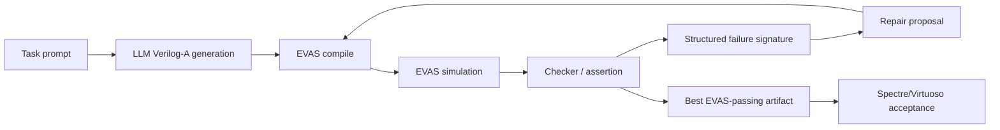
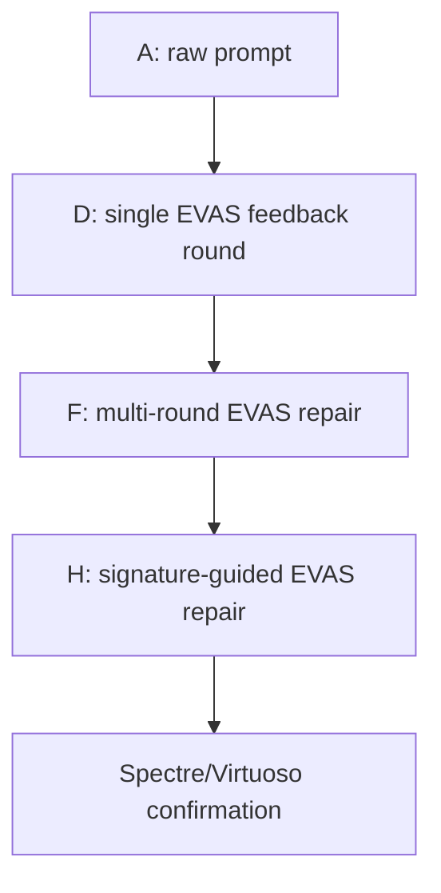

# vaEvas Figure Plan

Status: figure planning draft, 2026-04-26.

This file lists the figures needed by the bilingual paper draft. The current recommendation is to keep diagrams editable until the paper story is frozen, then render them as SVG/PDF or generate polished visuals.

## Figure 1: EVAS-Guided Closed-Loop Repair

Purpose: show the core contribution: EVAS is the fast executable feedback engine inside the LLM repair loop.

Mermaid source:



Suggested visual style:

1. EVAS loop in a bold colored inner cycle.
2. Spectre/Virtuoso as a final validation box outside the loop.
3. Show CSV/waveform/checker outputs between EVAS simulation and failure signature.

Image-generation prompt if needed:

```text
Create a clean academic systems diagram for a paper. The diagram shows an LLM generating Verilog-A from a task prompt, then an EVAS compile/simulation loop producing CSV traces, checker results, structured failure signatures, and repair prompts back to the LLM. Outside the loop, show Spectre/Virtuoso as final industrial acceptance validation. Use a professional IEEE-style visual design, white background, blue and orange accents, crisp vector shapes, no decorative icons, readable labels.
```

## Figure 2: Condition Ladder A/D/F/H

Purpose: explain why the main story can be simplified to A/D/F/H.

Mermaid source:



Suggested visual style:

1. Use a staircase or ladder.
2. Put pass counts next to each step: A 18/92, D 48/92, F 58/92, H 59/92.
3. Mark B/C/E/G as small side ablation bubbles, not in the main path.

## Figure 3: Failure Taxonomy and Feedback Quality

Purpose: show that compile/TB failures are mostly solved by EVAS repair, while remaining failures are behavior-level and motivate signature-guided repair.

Recommended plot:

1. grouped bar chart for A/D/F/H;
2. categories: behavior failure, DUT compile failure, TB compile failure, other;
3. use values from the latest snapshot:
   - A: 48, 20, 5, 1
   - D: 41, 1, 0, 2
   - F: 31, 1, 0, 2
   - H: 30, 1, 0, 2

## Figure 4: EVAS vs Spectre Consistency and Speed

Purpose: key missing evidence table/figure.

Required data:

1. task subset;
2. EVAS pass/fail;
3. Spectre/Virtuoso pass/fail;
4. EVAS runtime;
5. Spectre/Virtuoso runtime.

Recommended visualization:

1. left: agreement heatmap or confusion matrix;
2. right: runtime speedup bar chart.

Status: TBD until Spectre/Virtuoso runs are collected.

