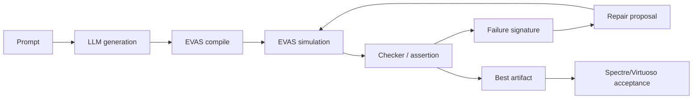
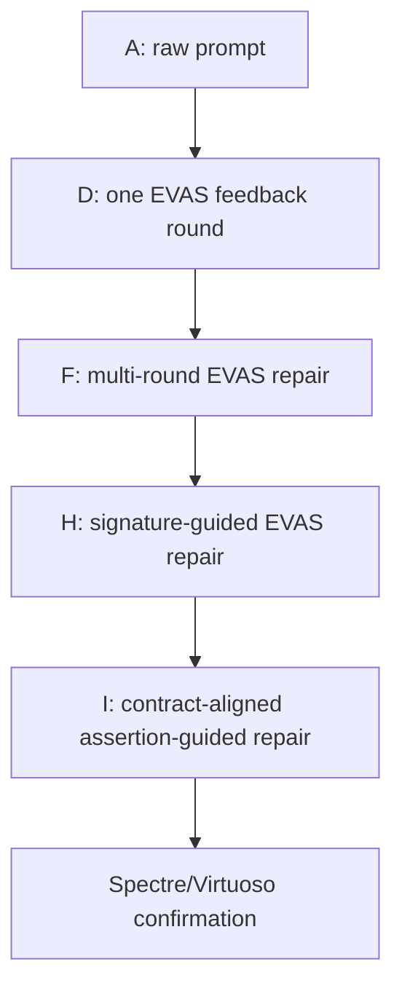
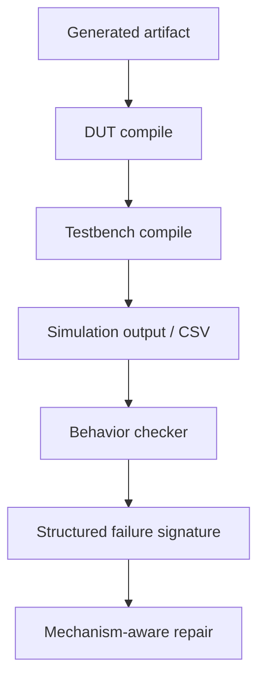
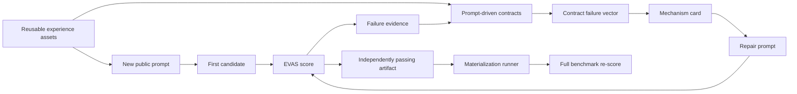

# vaEvas: Fast EVAS-Guided Closed-Loop Repair for LLM-Generated Verilog-A Behavioral Models

Status: working English manuscript draft, result-hygiene refreshed on 2026-04-29.

This draft supersedes the earlier framework-only draft. The current paper story is not only that `vaEvas` builds a benchmark, but that EVAS enables a fast executable feedback loop for improving LLM-generated Verilog-A. The core thesis is now twofold: EVAS is behaviorally aligned with Spectre/Virtuoso on voltage-domain behavioral tasks while being fast enough to serve as the inner repair loop, and the same low-cost executable verifier can also generate verified trajectories and mechanism templates for post-training or reinforcement-style optimization. Empty result cells are intentional and should be filled after the next Spectre/Virtuoso validation pass.

Chinese counterpart: [VAEVAS_PAPER_DRAFT_ZH.md](/Users/bucketsran/Documents/TsingProject/vaEvas/coordination/docs/paper/VAEVAS_PAPER_DRAFT_ZH.md)

Result ledger: [EXPERIMENT_RESULT_LEDGER.md](/Users/bucketsran/Documents/TsingProject/vaEvas/coordination/docs/benchmark/EXPERIMENT_RESULT_LEDGER.md)

Clean condition matrix: [CLEAN_EXPERIMENT_CONDITION_MATRIX.md](/Users/bucketsran/Documents/TsingProject/vaEvas/coordination/docs/benchmark/CLEAN_EXPERIMENT_CONDITION_MATRIX.md)

---

## Abstract

Large language models can produce plausible Verilog-A code, but direct text generation is unreliable for analog and mixed-signal behavioral models: candidates may fail to compile, instantiate incompatible testbenches, or simulate but violate the intended behavior. Industrial simulators such as Spectre/Virtuoso can validate these failures, but their runtime cost makes them unsuitable as the inner loop of repeated LLM repair or large-scale candidate filtering. We present `vaEvas`, an EVAS-guided framework for executable evaluation and closed-loop repair of LLM-generated Verilog-A behavioral models. The key observation is that, on the voltage-domain behavioral tasks studied here, EVAS can provide behaviorally consistent results with Spectre/Virtuoso while running fast enough to support high-throughput generate-simulate-repair iterations. In `vaEvas`, each candidate is compiled, simulated, checked against task-specific behavioral contracts, and repaired using structured EVAS feedback. This supports two uses: inference-time closed-loop repair, evaluated through the A/D/F/G/H/I condition ladder, and low-cost teacher-data construction, where verified artifacts and repair trajectories are distilled into reusable mechanism templates for future supervised or reinforcement-style optimization. Our current result ledger separates clean baselines, incremental repair evidence, engineering admission evidence, teacher-data evidence, and invalid/provisional runs. The results suggest that fast executable feedback is a necessary ingredient for reliable LLM-based Verilog-A generation and for scalable post-training data construction.

## 1. Introduction

Verilog-A behavioral models are central to analog and mixed-signal design flows. They allow engineers to model PLLs, data converters, calibration loops, phase detectors, signal sources, and mixed-signal control logic at a level that is executable in circuit simulators. Recent LLMs can generate code that looks syntactically plausible, but Verilog-A correctness is not a text property. A model is useful only if it compiles, interacts with the intended testbench, produces observable simulation traces, and satisfies the behavior specified by the task.

This makes Verilog-A generation harder to evaluate than ordinary code generation. A candidate may pass superficial inspection while hiding event-scheduling bugs, off-by-one cadence errors, degenerate waveforms, missing output activity, or simulator-incompatible constructs. A benchmark therefore needs executable evidence: compile results, simulation traces, behavioral checks, and simulator consistency.

The straightforward answer is to run every candidate in Spectre/Virtuoso. However, this is expensive when the goal is not one final validation but repeated repair. LLM repair only becomes practical when the simulator can be called many times per task. This is the role of EVAS in our work. We use EVAS as a fast behavioral feedback engine: it compiles and simulates generated Verilog-A, exposes errors through CSV traces and checkers, and returns structured failure signatures that can drive subsequent repair.

Our central thesis is:

> EVAS makes executable LLM repair practical because it is behaviorally aligned with Spectre/Virtuoso while being fast enough to serve as the inner loop of generate-simulate-repair optimization.

This thesis yields two paper threads. The first is inference-time repair: EVAS replaces Spectre as the high-throughput inner-loop feedback engine, while Spectre/Virtuoso remains the final acceptance reference. The second is data construction: because EVAS can validate many candidates, perturbations, and repair attempts cheaply, it can generate verified failure trajectories, repair trajectories, pass/fail preference pairs, and mechanism templates for later supervised fine-tuning, DPO/RLHF-style preference optimization, or mechanism-card retrieval.

This paper makes four contributions.

1. We introduce a 92-task executable Verilog-A generation benchmark with task prompts, generated artifacts, testbenches, and three-layer scoring: DUT compile, testbench compile, and simulation correctness.
2. We propose an EVAS-guided closed-loop repair workflow that turns simulator feedback into repair signals for LLM-generated Verilog-A.
3. We evaluate a staged A/D/F/G/H/I condition matrix that isolates raw prompting, public Verilog-A compatibility rules, single-round EVAS repair, multi-round EVAS repair, compile-clean repair, signature-guided repair, and contract/mechanism-card repair.
4. We develop signature-guided repair, contract-aligned assertion feedback, reusable mechanism cards, and validated fast checkers as a path toward higher-quality feedback, while keeping Spectre/Virtuoso acceptance as the final validation target. The experience layer is designed to transfer as mechanism templates rather than as task-specific answers.
5. We show how verified gold/R26 closure artifacts can be audited as teacher data: type-level mechanism templates are extracted from passing artifacts and validated under parameter perturbations before being considered for future training or retrieval.

The current draft reports EVAS-side results first because they are the basis of rapid iteration. The final paper should also include Spectre/Virtuoso acceptance for the main conditions and an EVAS-vs-Spectre behavior-consistency table.

## 2. Background and Motivation

### 2.1 Why Verilog-A Generation Needs Executable Evaluation

In RTL benchmarks such as VerilogEval, VGen, RTLLM, and OpenLLM-RTL, generated Verilog is evaluated by syntax checks and testbench execution. This basic lesson directly applies to Verilog-A: a natural-language prompt and a generated file are not enough. A Verilog-A task must define what it means to observe behavior.

Verilog-A adds several complications beyond digital RTL:

1. event timing and analog transitions can affect correctness;
2. save policies and observable signals determine whether a checker can read the result;
3. simulator compatibility matters because Verilog-A constructs are not always interpreted identically;
4. many tasks involve behavioral dynamics such as lock, reacquisition, sampling, quantization, and cadence.

For this reason, `vaEvas` evaluates generated models through execution. A candidate is only counted as successful when it compiles, runs, and satisfies the behavioral checker for the task.

### 2.2 EVAS as a Fast Behavioral Feedback Engine

EVAS is not used as a decorative replacement for Spectre. Its value is that it can move simulation into the repair loop. Spectre/Virtuoso remains the industrial acceptance reference, but EVAS supplies high-throughput feedback during optimization.

EVAS is fast because it solves a narrower problem than Spectre/Virtuoso. Spectre/Virtuoso is a SPICE-class simulator: it must assemble and solve circuit equations, typically through modified nodal analysis (MNA), current contributions, KCL/KVL constraints, nonlinear device equations, and continuous-time error control. EVAS deliberately targets an event-driven voltage-domain subset of behavioral Verilog-A. It supports constructs such as `V(node) <+ ...`, `V(a,b) <+ ...`, `cross()`, `above()`, `timer()`, and `transition()`, and evaluates behavioral state over voltage traces and event breakpoints rather than solving a full electrical network.

This speed therefore comes with an explicit trade-off. EVAS is not a general SPICE replacement. It does not claim support for arbitrary current-domain contributions, KCL/KVL device networks, `ddt()`/`idt()`/Laplace continuous-time operators, spectral noise functions, or behavior whose correctness depends on physical loading and current redistribution. In short, EVAS sacrifices full circuit-solver generality in exchange for fast execution on pure voltage-domain behavioral models.

This trade-off matches our benchmark. Most LLM-generated Verilog-A tasks in this work ask for functional behavior: code coverage, divider cadence, PFD pulse timing, PLL lock behavior, output activity, observable CSV traces, and testbench compatibility. For these tasks, the primary question is usually not whether a realistic current-domain network is solved, but whether the behavioral model produces the expected voltage-domain signals under a known stimulus. EVAS is therefore used as the fast inner-loop proxy, while Spectre/Virtuoso remains the final acceptance simulator for key results.

| EVAS design choice | Speed benefit | Cost / boundary |
|---|---|---|
| Event-driven `cross/timer/above` execution | Updates behavior around timesteps and event breakpoints instead of solving a full circuit at every point. | Not equivalent to Spectre's full LTE-controlled continuous-time solver. |
| Voltage-domain `V() <+` behavioral contributions | Reads and updates voltage states directly, avoiding MNA matrix solves. | Does not support general `I() <+` current contributions or KCL network solving. |
| Behavioral `transition/slew/last_crossing` approximations | Produces observable waveforms and timing features cheaply. | Does not claim exact semantics for all analog operators. |
| CSV/checker-oriented benchmark output | Enables large-scale automated scoring and LLM repair. | Requires explicit observable contracts and save policies. |

The intended evidence chain is:

1. show that EVAS and Spectre/Virtuoso agree on behavioral outcomes for representative benchmark tasks;
2. show that EVAS is substantially faster than Spectre/Virtuoso on the same stimuli;
3. use EVAS to run many repair candidates and iterations;
4. confirm the key improvements in Spectre/Virtuoso.

This distinction matters. If EVAS were merely faster but not behaviorally aligned, its feedback would not be trustworthy. If EVAS were aligned but not faster, it would not enable high-frequency repair. The contribution requires both properties.

This also clarifies how to read the A/D/F/G/H/I table. The table is not mainly a prompt-engineering leaderboard. It measures how different forms of EVAS feedback change the generation process: A has no execution feedback; D/F add one or multiple EVAS repair rounds; G attempts to eliminate compile, interface, and artifact-surface failures before deeper behavior repair; H/I turn EVAS notes into signatures, contracts, and mechanism-card guidance. The intended claim is that fast, aligned executable feedback turns generation from a one-shot guess into an optimizable process.

The same property enables post-training data construction. Spectre/Virtuoso is the right final acceptance reference, but using it to generate thousands of candidate trajectories, repair trajectories, parameter perturbations, and pass/fail preference pairs is expensive. EVAS can act as the scalable verifier for this data-generation layer, with Spectre/Virtuoso reserved for targeted acceptance and calibration.

### 2.3 Relation to Assertion-Based Verification

OpenLLM-RTL and related work show that verification quality can matter more than raw data volume. Their assertion-based filtering strategy uses automatically generated assertions and formal verification to select higher-quality RTL training samples. Our setting is different because we do not train a new model; instead, we use executable EVAS feedback at inference and repair time.

The shared principle is that the model needs a strong verifier. In our case, the verifier is not only a pass/fail oracle. It also produces structured failure signatures such as missing CSV outputs, code coverage failures, counter cadence mismatches, edge-window mismatches, no-overlap failures, or PLL lock failures. These signatures are the bridge between simulation and repair.

## 3. Benchmark and Task Contract

### 3.1 Task Structure

Each benchmark task contains:

1. a natural-language prompt describing the target Verilog-A behavior;
2. generated DUT and testbench artifacts;
3. metadata describing family, category, and expected files;
4. EVAS runner configuration;
5. task-specific behavioral checks.

The benchmark covers four families:

| Family | Role |
|---|---|
| End-to-end | Generate a full Verilog-A DUT and testbench for a behavioral task. |
| Spec-to-VA | Generate Verilog-A from a specification-like description. |
| Bugfix | Repair a flawed Verilog-A artifact. |
| TB generation | Generate or repair a testbench/harness. |

The current formal matrix uses 92 tasks. Earlier paper stats recorded 76 tasks and should be treated as historical unless refreshed.

### 3.2 Scoring

Each task is scored through three primary gates:

1. `dut_compile`: whether the generated DUT compiles;
2. `tb_compile`: whether the generated testbench/harness compiles and runs;
3. `sim_correct`: whether the resulting EVAS simulation satisfies the task-specific checker.

The final `Pass@1` number requires all required gates to pass for the task. Failures are attributed into categories such as DUT compile failure, testbench compile failure, simulation correctness failure, timeout, missing observable CSV, or unsupported checker coverage.

### 3.3 Public Contract and Non-Leakage

The task prompt must expose the behavior required to make the task well-defined, but it should not reveal the gold implementation. This balance mirrors the concern raised by OpenLLM-RTL: if the description is too vague, the benchmark tests ambiguity rather than generation capability; if it is too detailed, generation becomes code translation.

Our contract policy is:

1. public prompts should include required interfaces, observable outputs, and essential behavior;
2. prompts should not include gold code structure or task-specific repair templates;
3. repair-time feedback may include generalized circuit principles and failure signatures;
4. signature-guided templates must be triggered by failure evidence, not by task name.

Here, a contract is not a leak of checker code or gold implementation. It is the public behavioral specification required for the task to be well-defined. If the checker ultimately evaluates divider cadence, ADC code coverage, PFD pulse windows, or PLL lock behavior, then those properties should appear in the public task contract in natural-language or structured form. Assertion-style checkers can then turn the public contract into executable predicates used for EVAS-side failure localization.

## 4. Method: EVAS-Guided Closed-Loop Repair

### 4.1 Overall Loop

The method is a repeated executable repair loop:

```text
Prompt -> LLM generation -> EVAS compile/simulate -> checker/assertion
       -> structured failure signature -> repair proposal -> EVAS recheck
       -> select best candidate -> optional Spectre/Virtuoso acceptance
```

This loop differs from static prompt engineering. It uses actual execution results to decide what to repair. It also differs from random retry: every additional attempt is conditioned on simulator evidence.

### 4.2 Feedback Types

EVAS feedback is organized into several layers.

| Feedback layer | Example signal | Repair value |
|---|---|---|
| Syntax/compatibility | unsupported construct, compile error | Forces the model away from invalid Verilog-A patterns. |
| Harness/observable | missing `tran.csv`, missing saved signal, no edges | Localizes whether the issue is DUT, TB, or save policy. |
| Behavioral checker | code coverage, cadence mismatch, lock failure | Indicates which functional property is violated. |
| Signature-guided repair | `interval_hist`, `only_N_codes`, `not_enough_edges` | Maps repeated failure patterns to reusable repair families. |

### 4.3 Conditions

The main story can be expressed with four conditions:

| Condition | Description | Question answered |
|---|---|---|
| A | Raw prompt generation | How strong is the LLM without executable feedback? |
| D | Single-round EVAS repair | Does one simulation-feedback round help? |
| F | Multi-round EVAS repair | Does EVAS speed enable better multi-round optimization? |
| H | Signature-guided EVAS repair | Does higher-quality structured feedback improve repair? |
| I | Contract-aligned assertion-guided repair, ongoing | Can public behavioral contracts and executable assertions further improve localization? |

Additional controls should be reported separately rather than bloating the main table:

| Control | Purpose |
|---|---|
| Random retry with same LLM budget | Shows whether gains come from feedback rather than more samples. |
| Static skill-only or checker-transparent prompt | Tests whether static knowledge alone can replace EVAS feedback. |
| H template ablation | Shows that H does not rely on task-name overfitting. |

### 4.4 Signature-Guided Repair

The H condition is not intended to hard-code individual benchmark answers. Instead, it uses reusable failure mechanisms:

| Template family | Trigger evidence | Intended repair scope |
|---|---|---|
| Counter cadence/off-by-one | interval or count mismatch | Dividers, timers, programmable cadence. |
| Sampled latch/reset priority | sample mismatch or reset-edge mismatch | DFF, sample-hold, edge-triggered blocks. |
| Quantizer/code coverage | missing codes or reversals | ADC/DAC quantizers. |
| One-hot/thermometer/no-overlap | overlap, missing selection, wrap failure | DWA and thermometer logic. |
| Frame/sequence alignment | frame mismatch, sequence mismatch | Serializers, PRBS, LFSR. |
| PLL/PFD timing window | lock, pulse-width, phase-window failure | PLL and phase-detector tasks. |
| Multi-module interface sanity | missing CSV, undriven submodule output | Multi-module artifacts and harness mismatch. |

Only templates that rescue multiple tasks under signature-gated triggering should be promoted into the formal method. Single-task rescues should be recorded as exploratory evidence.

### 4.5 Contract-Aligned Assertion-Guided Repair

The ongoing next layer can be treated as condition I. It addresses a weakness of H: even structured failure signatures may not clearly identify which public task contract was violated. Condition I therefore binds the public task contract, assertion-style checker feedback, and mechanism cards.

The intended loop has three layers:

1. **Public contract layer.** The prompt or task specification states the required interface, observable signals, behavioral metrics, and simulation windows without revealing the gold implementation.
2. **Executable assertion layer.** The public contract is translated into EVAS-checkable predicates, such as code coverage, cadence ratio, pulse width, lock window, or sequence alignment.
3. **Repair feedback layer.** When EVAS fails, the repair prompt reports the violated contract item, observed value, target range, and likely module or signal region.

This follows the verification-quality lesson from OpenLLM-RTL, but uses assertions at repair time rather than as a training-data filter. Condition I does not expose hidden checker code, gold traces, or task-specific answers to the model. It converts public prompts, public observables, and simulation-measured failure vectors into more actionable repair targets.

### 4.6 Experience Distillation and Cold-Start Repair

The experience in `vaEvas` should not be understood as saving locally passing task code, nor as hand-writing a dedicated `contracts.json` for every benchmark case. Transferable experience is restricted to four reusable asset types:

1. **Verilog-A skills:** general EVAS-compatible coding rules, event usage, timer scheduling, and transition discipline;
2. **contract types:** reusable checks such as `edge_count`, `output_span`, `code_coverage`, `frequency_ratio`, `paired_edge_response`, and `differential_range`;
3. **prompt-driven mechanism inference:** rules that infer ADC/DAC, PFD, PLL, serializer, Gray-counter, and related mechanism families from public prompts and observables;
4. **mechanism cards:** mappings from contract failure vectors to generic repair strategies, such as repairing an ADC-DAC quantization/reconstruction chain when input activity exists but code/output coverage fails.

A new environment therefore does not need the current local `results/` history before it can use the loop. The cold-start workflow is:

```text
public prompt + reusable skill/mechanism templates
  -> first generation and EVAS scoring
  -> result.json, notes, tran.csv, and compile logs
  -> prompt/public-signal/failure-driven contracts.json
  -> contract_check mechanism-level failure vector
  -> mechanism-card selection and repair prompt construction
  -> repeated scoring until an independently passing artifact appears
  -> materialization runner and full benchmark re-score
```

This makes experience a localization and repair prior, not an answer cache. Without prior run history, the first round relies on prompt-driven contracts and reusable skills. After one failed run, the loop creates its own instance-specific evidence and can repair with finer guidance. This is also the main overfitting guardrail: new knowledge should be added at the mechanism-family level, not at the task-name level.

### 4.7 EVAS as a Post-Training Data Engine

EVAS also makes post-training data construction cheaper. For Verilog-A, the valuable data is not just more text; it is executable trajectory data: which candidates compile, which candidates simulate, which syntactically valid candidates fail behavior, which repair converts `only_2_codes` into full code coverage, and which mechanism template remains correct under parameter perturbation.

The EVAS-generated data can be organized into four reusable forms:

| Data form | Source | Possible use |
|---|---|---|
| Pass/fail preference pair | Multiple candidates for the same prompt scored by EVAS/checkers | DPO/RLHF-style preference learning toward executable correctness. |
| Repair trajectory | Failed artifact, EVAS feedback, repair prompt, next result | SFT on simulation-guided repair behavior. |
| Mechanism template | Type-level pattern distilled from gold/R26 passing artifacts | Mechanism cards, retrieval, skeleton generation, or curriculum data. |
| Parameterized variant | Revalidated perturbations of period, code, VDD, window, or bit width | Anti-overfitting test and near-neighbor benchmark construction. |

This is why the historical 92/92 R26 closure remains useful even though it should not be reported as a cold-start pass rate. It can be treated as a teacher-data source. We can extract how PLL feedback cadence is maintained, how DWA pointer/window state is coupled, how PFD UP/DN pulses are made mutually exclusive, or how ADC/DAC quantization and reconstruction share one code. The new gold/R26 template generalization audit follows this idea: four mechanism templates are extracted from verified R26 artifacts and revalidated under parameter perturbations, currently passing 14/14 EVAS variants. This suggests that at least part of the historical closure can be converted into transferable teacher signals rather than task-specific patches.

### 4.8 Toward Circuit-Mechanism RAG

The current mechanism cards are an auditable intermediate layer: they translate EVAS/contract failure vectors into short repair guidance. In a larger system, however, mechanism cards should not remain a manually curated rule list. They are better viewed as structured knowledge nodes inside a circuit-mechanism retrieval system. The retrieval key should not be a task name or a single keyword, but a circuit relation graph derived from the public prompt, port roles, observables, EVAS notes, and contract failures.

A future circuit-mechanism RAG knowledge base can be organized into three layers:

| Knowledge layer | Content | Role |
|---|---|---|
| Circuit knowledge | Principles and submodule relations for ADCs, PLLs, PFDs, DWA, SAR/CDAC, calibration, and mixed-signal sequencing | Supplies system-level constraints beyond single-signal checks. |
| Mechanism templates | Relations such as `quantize-reconstruct`, `feedback-divider-lock`, `pointer-window-enable`, and `edge-order-pulse` | Compresses circuit principles into reusable implementation constraints. |
| Failure trajectories | EVAS notes, contract failure vectors, failed code shapes, and successful repair strategies | Retrieves concrete repair evidence for the current failure. |

The intended flow is:

```text
public prompt + ports + EVAS notes/tran.csv
  -> functional IR / circuit relation graph
  -> retrieve similar mechanisms, failures, and verified variants
  -> compress retrieved evidence into mechanism-card guidance
  -> LLM repair
  -> EVAS verify
  -> write back successful and failed trajectories
```

In this design, mechanism cards remain useful, but their role changes. They are not the final knowledge base; they are the controlled summary format for retrieved evidence. RAG can retrieve richer circuit knowledge, gold/R26 templates, parameter sweeps, and prior failure trajectories, while the mechanism card compresses the result into a concise, non-leaky, auditable repair hint. This also addresses the limitation of the current deterministic selector by moving from keyword matching toward functional graph matching and similar-failure retrieval.

A first pilot confirms that retrieval quality and repair success must be evaluated separately. On 23 no-API retrieval cases, adding functional IR, R26 mechanism nodes, and DWA-specific guards gives 20/20 positive top-3 hits, but still leaves 5/23 forbidden top-3 retrievals; this motivates a final negative guard before retrieved evidence is injected into repair prompts. We then ran a small end-to-end repair pilot on eight final-G residual failures. The diversified RAG prompt rescued `dwa_ptr_gen_no_overlap_smoke`: the G baseline failed behavior, RAG round 1 moved the design to an active but overlapping cell window (`max_active_cells=8`, `overlap_count=7`), and RAG round 2 reached `overlap_count=0`. After fixing a save-continuation staging bug, the repaired artifact passes both standard EVAS and real Spectre strict validation. A same-budget no-RAG DWA control did not pass in two rounds. This is pilot evidence rather than a full condition result, but it shows that R26/system-relation knowledge can be converted into a real new pass when retrieved and summarized correctly.

We then made this experience layer more explicit by adding a `Circuit-Mechanism Skeleton` layer. The current skeleton library covers four R26/closure-derived mechanisms: DWA pointer-window enable, ADC-DAC quantize/reconstruct, PFD edge-pulse windows, and PLL feedback cadence. Each skeleton contains a slot schema, implementation skeleton, Verilog-A shape, and anti-patterns. During repair, the prompt now retrieves a skeleton first, then an R26 template, a repair card, and a prompt template. In the same eight-task pilot, Skeleton-RAG again rescues the DWA case and passes both standard EVAS and Spectre strict validation, but it does not yet rescue the harder PLL/ADC/PFD cases. This suggests that skeletons are a necessary intermediate representation, but the current form is still generic; the next layer should be a slot-bound skeleton generator that binds public port names, parameters, bit widths, reset polarity, save nodes, and metric gaps.

## 5. Experimental Setup

### 5.1 Models

The current main snapshot uses Kimi as the primary model. Qwen is used as a secondary cross-model comparison. Other model attempts are historical diagnostics and should not be part of the main narrative unless rerun under the current system.

A model-comparison table should be reserved in the final paper to show whether the framework generalizes beyond a single LLM. The goal is not merely to rank models, but to compare how different models fail, how much they benefit from EVAS feedback, and whether their EVAS-side gains transfer to Spectre/Virtuoso.

| Model | Condition A: raw-prompt EVAS | Best F/H EVAS repair | Spectre/Virtuoso acceptance | Dominant failure modes | Notes |
|---|---:|---:|---:|---|---|
| Kimi | clean-candidate 35/92; current 20/92 invalid | current F: 61/92; H-on-F: 65/92 | TBD | Behavior failures dominate after repair. | 2026-04-27 A/B/C are placeholder-contaminated; I-cold-start v0 is provisional. |
| Qwen | clean-candidate 25/92; current 26/92 | F: 28/92 | TBD | Validation/interface failures are more common. | G current has incomplete samples. |
| GPT-5.5/API model | TBD | TBD | TBD | TBD | Requires a reproducible API entry. |
| Other models | TBD | TBD | TBD | TBD | Include only after rerunning with the current system. |

### 5.2 Metrics

Primary metrics:

1. `Pass@1`;
2. pass count out of 92 tasks;
3. family-level pass rate;
4. failure taxonomy;
5. Spectre/Virtuoso acceptance for selected final conditions.

Secondary metrics:

1. EVAS runtime;
2. Spectre/Virtuoso runtime;
3. EVAS-vs-Spectre agreement;
4. repair eligibility, rescued count, and unsupported count.

### 5.3 Current System Configuration

The latest snapshot includes:

1. per-task EVAS output isolation for parallel scoring;
2. fingerprinted resume cache;
3. contract-based save policy;
4. parity-validated fast checkers enabled by default;
5. DFF checker sampling-window fix;
6. signature-gated H prototype.

## 6. Results

### 6.1 Main EVAS Matrix

Current Kimi results, separated by evidence status:

| Condition | Description | Pass@1 | Pass count |
|---|---|---:|---:|
| A/B/C current | Raw/checker/checker+skill prompt | mixed | 20/92, 29/92, 29/92; invalid-baseline |
| A/B/C clean-candidate | 2026-04-25 historical baseline | 0.3804 / 0.4674 / 0.4022 | 35/92, 43/92, 37/92 |
| D | Single-round EVAS repair, no skill | 0.5978 | 55/92 |
| E | Single-round EVAS repair + skill | 0.5870 | 54/92 |
| F | Multi-round EVAS repair, no skill | 0.6630 | 61/92 |
| G | Multi-round EVAS repair + skill | 0.6304 | 58/92; incomplete-sample caveat |
| H-on-F | Signature-guided H-on-F prototype | 0.7065 | 65/92; incremental evidence |
| I-cold-start v0 | Contract-aligned replay from A failures | 0.6304 | 58/92; provisional |
| I-runner / I-final | Materialization and closure evidence | 0.8043 / 1.0000 | 74/92 / 92/92; engineering evidence |

The clearest trend is that executable EVAS feedback changes the regime. Static prompt changes improve over raw prompting, but the major jump comes from simulation-guided repair.

### 6.2 Recommended Main-Table Simplification with I Reserved

For the paper's main story, clean A/D/F/H should present the completed evidence
chain, while I-cold-start v1 should be reserved as the ongoing next method
layer.  The current I-cold-start v0 is only a pipeline smoke result.

| Condition | Pass count | Main claim |
|---|---:|---|
| A | 35/92 clean-candidate; 20/92 invalid current | Raw LLM generation is insufficient; final number requires clean rerun. |
| D | 55/92 | One EVAS feedback round substantially improves generation. |
| F | 61/92 | EVAS speed enables useful multi-round repair. |
| H-on-F | 65/92 | Structured failure signatures improve residual repair. |
| I-cold-start v1 | TBD | Contract-aligned assertion feedback must be rerun from a clean A anchor. |

B/C/E/G remain useful ablations, but they should not distract from the main feedback loop.

### 6.3 Family-Level Results

| Condition | End-to-end | Spec-to-VA | Bugfix | TB generation |
|---|---:|---:|---:|---:|
| A | 0.0909 | 0.1667 | 0.5000 | 0.5455 |
| D | 0.4182 | 0.4444 | 0.7500 | 1.0000 |
| F | 0.5636 | 0.5556 | 0.7500 | 1.0000 |
| H | 0.5636 | 0.6111 | 0.7500 | 1.0000 |

The largest improvements occur in end-to-end and spec-to-VA tasks, where raw generation frequently fails either compile or behavior.

### 6.4 Failure Taxonomy

| Condition | Simulation correctness failures | DUT compile failures | TB compile failures | Other |
|---|---:|---:|---:|---:|
| A current invalid | 48 | 20 | 5 | 1 |
| D | 41 | 1 | 0 | 2 |
| F | 31 | 1 | 0 | 2 |
| H | 30 | 1 | 0 | 2 |

This table supports a nuanced claim. EVAS-guided repair sharply reduces compile and testbench failures, but the remaining hard problems are mostly behavior failures. This motivates signature-guided and assertion-style feedback.

### 6.5 H and H2 Evidence

Condition H-on-F currently improves the clean current F repair evidence from 61/92 to 65/92. This should be interpreted as incremental repair evidence, not as a cold-start baseline. The rescues observed in diagnostic settings include divider cadence, multimod divider cadence, flash/ADC code coverage, edge liveness, and part of the PFD/PLL window family.

H2 probes on the remaining failure set show that more tasks can be rescued when generated-testbench repair, validated fast checkers, and transferable DUT templates are combined. The conservative fast-default H2 failure-anchor result reaches 10/33 on the H-on-F failure set. This is not yet a full 92-task formal condition, but it identifies promising mechanisms for the next method iteration.

### 6.6 I: Contract-Aligned Assertion Loop and Cold-Start Feasibility

Condition I is the active optimization direction that aligns task contracts with checker/assertion feedback. It should not be confused with condition B. B statically exposes more checker information before generation; I uses executable assertion failures after EVAS simulation to guide repair.

The key questions to validate are:

1. whether I reduces behavior failures caused by mismatch between prompt-visible goals and checker goals;
2. whether I turns coarse `FAIL_SIM_CORRECTNESS` outcomes into actionable contract violations;
3. whether I improves the remaining F/H failure set without leaking gold implementation details;
4. whether I's gains transfer to Spectre/Virtuoso acceptance.

The current implementation validates the feasibility of the main components:

| Component | Validation result | Meaning |
|---|---:|---|
| Prompt-driven mechanism inference | 57/57 validation matches | Mechanism templates can be triggered from public prompt evidence rather than task-name lookup. |
| Prompt-driven contract generation | 29 tasks, 210 contracts | Failing diagnostic tasks can receive mechanism-level `contracts.json` automatically. |
| Materialization runner | 9 base-fail PASS artifacts admitted | Independently verified repairs can be combined without manual copying. |
| I-cold-start v0 replay | 58/92, Pass@1=0.6304 | Provisional pipeline smoke only, because the A anchor was later found to be placeholder-contaminated. |
| Materialization runner | 74/92, Pass@1=0.8043 | Engineering admission evidence; independently verified repairs can be combined without manual copying. |
| R26 final admission | 92/92, Pass@1=1.0000 | Engineering closure evidence, not cold-start model performance. |

The 74/92 and 92/92 results are not one-shot cold-start generation results. They are controlled admission and closure results: contract-guided repair experiments first produced independently passing candidates, and the materialization runner then admitted only safe replacements. The existing I-cold-start v0 replay is also not paper-ready because it inherited a contaminated A anchor. A future formal I-cold-start v1 must connect clean A generation, automated repair, and automated admission end to end under a no-leakage configuration.

### 6.7 EVAS-Spectre Consistency and Runtime

This is the most important missing table for the final paper.

| Task subset | # tasks | EVAS/Spectre behavior agreement | EVAS median runtime | Spectre median runtime | Speedup |
|---|---:|---:|---:|---:|---:|
| Basic smoke tasks | TBD | TBD | TBD | TBD | TBD |
| Data-converter tasks | TBD | TBD | TBD | TBD | TBD |
| PLL/PFD tasks | TBD | TBD | TBD | TBD | TBD |
| Full selected acceptance set | TBD | TBD | TBD | TBD | TBD |

This table is necessary because it justifies EVAS as the fast proxy used by the repair loop.

### 6.8 Spectre/Virtuoso Final Acceptance

This table should be filled only after running selected final artifacts in Spectre/Virtuoso.

| Condition | EVAS pass count | Spectre/Virtuoso pass count | Agreement | Notes |
|---|---:|---:|---:|---|
| A | clean-candidate 35/92; current 20/92 invalid | TBD | TBD | Raw baseline; final number requires clean rerun. |
| D | 55/92 | TBD | TBD | Single-round EVAS repair. |
| F | 61/92 | TBD | TBD | Main multi-round EVAS repair evidence. |
| H-on-F | 65/92 | TBD | TBD | Signature-guided incremental prototype. |
| I-cold-start v1 | TBD | TBD | TBD | Must rerun from a clean A anchor. |

The final claim should be based on both EVAS-side improvement and Spectre/Virtuoso confirmation on the key conditions.

## 7. Analysis

### 7.1 What EVAS Repair Solves Well

EVAS feedback is effective for:

1. syntax and simulator-compatibility errors;
2. missing generated files or invalid testbench wiring;
3. observable contract problems such as missing CSV signals;
4. simple local behavior failures such as counters, dividers, quantizers, and reset sampling;
5. candidate selection when multiple repair variants are generated.

These are cases where the failure is local enough that simulation evidence can guide a safe correction.

### 7.2 Why Some Failures Remain Hard

The remaining failures are usually not caused by a lack of syntax information. They often require deeper behavioral reasoning:

1. PLL and ADPLL failures may require submodule-level reasoning about phase detection, loop filtering, divider feedback, and lock windows.
2. Multi-module tasks may fail because one submodule is correct but the harness or interface is wrong.
3. Some generated artifacts produce no activity, leaving the checker with too little evidence.
4. Some repair prompts modify the wrong region or break a previously correct part of the design.

This suggests that the next stage should not simply add more repair rounds. It should improve localization, submodule diagnosis, and assertion-style failure signatures.

### 7.3 Why Static Skills Are Not Enough

The current results show that skill injection is not automatically beneficial. Conditions C, E, and G do not dominate their no-skill counterparts. A plausible explanation is that static knowledge can help with style but does not know which specific behavior failed in a generated artifact. In contrast, EVAS feedback is instance-specific: it reports what actually happened in simulation.

This does not mean domain knowledge is useless. It means domain knowledge should be activated by evidence, not injected blindly. This is the motivation for signature-gated templates and possible future RAG over reusable circuit mechanisms.

## 8. Related Work

### Executable HDL generation benchmarks

VerilogEval, VGen, RTLLM, and OpenLLM-RTL establish the importance of executable evaluation for digital HDL generation. Their benchmarks typically provide prompts, reference designs, and testbenches. `vaEvas` follows this execution-first principle but applies it to Verilog-A behavioral modeling, where analog behavior, event timing, and simulator compatibility are central.

### Assertion-based verification and data quality

OpenLLM-RTL introduces AssertEval and uses assertion-guided functional checking to construct a smaller but higher-quality verified dataset. This supports an important lesson: verified feedback can be more valuable than raw volume. Our work adopts the same philosophy at inference time. Instead of training on verified data, we repair candidates using EVAS-based executable feedback and failure signatures.

### Analog and mixed-signal behavioral modeling

Verilog-A modeling has a long history in analog and mixed-signal design, but public LLM-oriented Verilog-A benchmarks remain limited. Existing RTL benchmarks cannot directly capture Verilog-A-specific issues such as analog observability, transition behavior, save policies, continuous-time simulation, and cross-simulator consistency. `vaEvas` targets this gap.

## 9. Limitations

The current system has several limitations.

1. Kimi A/B/C current-regression rows must be rerun from a clean generated root; the current rows are placeholder-contaminated.
2. I-cold-start v0 is only a pipeline smoke result and must be replaced by clean I-cold-start v1.
3. H is still an incremental prototype rather than a cold-start condition.
4. Spectre/Virtuoso acceptance results are still missing from the main condition matrix.
5. Some tasks remain sensitive to checker runtime and observable configuration.
6. The benchmark should include a random-retry control to rule out the possibility that gains come only from more LLM attempts.
7. Template-based repair must be audited for overfitting by requiring signature-based rather than task-name-based triggering.

These limitations are useful rather than embarrassing: they define the next experiments needed to make the paper rigorous.

## 10. Planned Experiments

The next experiments should be prioritized as follows.

1. EVAS-Spectre consistency and speed table on a selected representative set.
2. Spectre/Virtuoso acceptance for A, D, F, and H final artifacts.
3. Same-budget random retry control against D/F/H.
4. Implement and evaluate condition I: contract-aligned assertion-guided repair.
5. Cold-start replay: start without prior run results, load only skills, contract types, and mechanism cards, and verify that the first failed run creates enough evidence for automated localization and repair; include a no-leakage ablation where contract generation uses only public prompts, public observables, first-round failure evidence, and generic mechanism templates.
6. H/I ablations: signature-gated templates, contract-only feedback, assertion-only feedback, and contract+assertion feedback.
7. H2/I formalization on the full 92-task matrix if failure-anchor results remain promising.
8. Failure taxonomy table separating syntax, harness, observable, and behavior failures.

## 11. Figures

### Figure 1: EVAS-guided repair loop



### Figure 2: Condition ladder



### Figure 3: Failure signal hierarchy



### Figure 4: Reusable experience layer and cold-start loop



## 12. Conclusion

This draft argues that the central bottleneck in LLM-generated Verilog-A is not only model capability, but the lack of fast executable feedback. EVAS addresses this bottleneck by making simulation cheap enough to become the inner loop of repair. It also makes verified data generation practical: failed artifacts, repair attempts, pass/fail preference pairs, and parameterized mechanism variants can be collected at far lower cost than a Spectre-only loop, while Spectre/Virtuoso remains the final acceptance reference. After result hygiene auditing, the paper should separate clean baselines, incremental repair evidence, engineering admission, teacher-data evidence, and invalid/provisional rows rather than mixing all pass counts into one table. The current evidence still shows that EVAS-guided repair improves generated Verilog-A, and that contract-guided experience can be distilled into generic contract types, prompt-driven mechanism inference, mechanism cards, and reusable teacher signals. The next step is to rerun clean A/B/C, replace I-cold-start v0 with clean I-cold-start v1, complete the Spectre/Virtuoso consistency and acceptance tables, and turn the gold/R26 template audit into an executable near-neighbor benchmark for no-leak repair and post-training data construction.
