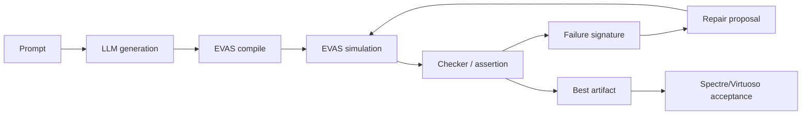
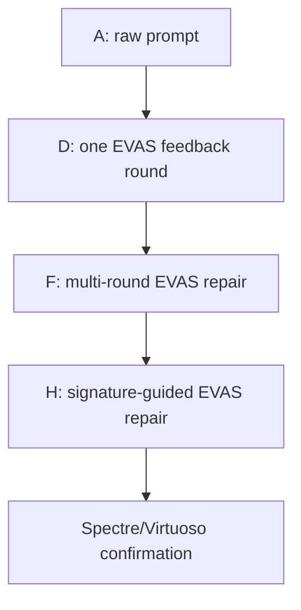
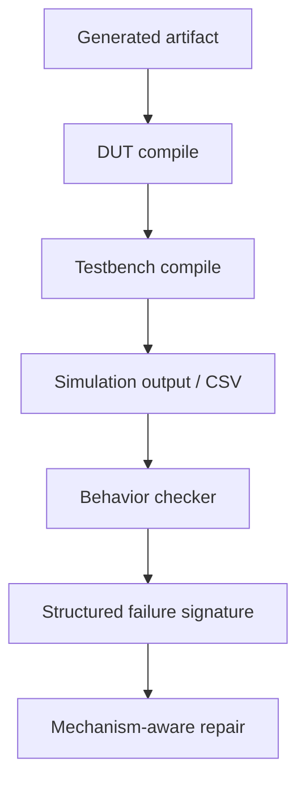

# vaEvas：面向 LLM 生成 Verilog-A 行为模型的 EVAS 快速闭环修复框架

状态：中文论文草稿，更新于 2026-04-26。

这版草稿用于统一论文叙事。它不再只把 `vaEvas` 写成一个“框架/benchmark 整理项目”，而是把核心贡献放在：**EVAS 与 Spectre/Virtuoso 行为一致且更快，因此可以作为 LLM 生成 Verilog-A 的高吞吐仿真反馈引擎，支撑多轮闭环修复。**

英文对应稿：[VAEVAS_OPENLLM_STYLE_DRAFT.md](/Users/bucketsran/Documents/TsingProject/vaEvas/coordination/docs/paper/VAEVAS_OPENLLM_STYLE_DRAFT.md)

最新实验快照：[LATEST_SYSTEM_SNAPSHOT_2026-04-26.md](/Users/bucketsran/Documents/TsingProject/vaEvas/behavioral-veriloga-eval/docs/project/LATEST_SYSTEM_SNAPSHOT_2026-04-26.md)

---

## 摘要

大语言模型已经能够生成看起来合理的 Verilog-A 代码，但直接文本生成对模拟/混合信号行为模型仍然不可靠：生成结果可能存在语法错误、testbench/harness 不匹配、不可观测输出，或者虽然能够仿真却不满足目标行为。Spectre/Virtuoso 可以作为工业级仿真验证工具发现这些问题，但其运行成本较高，不适合作为多轮 LLM 修复的内层循环。本文提出 `vaEvas`，一个基于 EVAS 的 Verilog-A 可执行评测与闭环修复框架。核心观察是：EVAS 能够与 Spectre/Virtuoso 在行为判断上保持一致，同时具有更快的仿真速度，因此可以支撑高吞吐的“生成-仿真-检查-修复”循环。在 `vaEvas` 中，每个候选模型都会经过编译、EVAS 仿真、行为 checker 判断，并将失败信息结构化为可用于修复的反馈。在当前 92 个任务的 Kimi 快照中，裸 prompt 仅通过 18 个任务，多轮 EVAS 闭环修复通过 58 个任务，signature-guided 修复原型进一步达到 59 个任务。后续论文需要补充 EVAS-Spectre 行为一致性与 Spectre/Virtuoso 最终验收表，以证明 EVAS 闭环带来的提升能够迁移到工业仿真器。整体结果说明，快速可执行反馈是提升 LLM Verilog-A 生成可靠性的关键。

## 1. 引言

Verilog-A 行为模型在模拟与混合信号设计流程中非常重要。工程师会用它描述 PLL、ADC/DAC、校准环路、相位检测器、信号源以及混合信号控制逻辑。虽然现代 LLM 可以生成语法上看似合理的代码，但 Verilog-A 的正确性不是文本层面的属性。一个模型是否有用，必须看它能否编译、能否和 testbench 正确连接、能否产生可观测波形、以及是否满足任务行为。

这使得 Verilog-A 生成比普通代码生成更难评测。生成代码可能看起来没有问题，但内部存在事件调度错误、计数节拍 off-by-one、输出无活动、码字覆盖不足、锁定失败、或者使用了仿真器不兼容的写法。因此，一个可靠 benchmark 不能只比较文本，也不能只看语法，而必须要求可执行证据：编译结果、仿真波形、行为检查以及仿真器一致性。

最直接的方式是把所有候选都放到 Spectre/Virtuoso 中验证。但这对于闭环修复太慢。LLM 修复不是一次仿真，而是需要不断生成候选、运行仿真、读取失败信息、再次修复。只有当仿真足够快时，这个循环才现实可行。

这就是 EVAS 在本文中的角色。EVAS 不是简单替代 Spectre 的工具，而是一个快速行为反馈引擎。它可以快速编译和仿真 LLM 生成的 Verilog-A，输出 CSV/波形结果，并通过 checker 生成结构化失败信息，使 LLM 可以基于真实执行结果进行修复。

本文核心观点是：

> EVAS 与 Spectre/Virtuoso 行为一致，同时速度足够快，因此可以把仿真验证放入 LLM 生成 Verilog-A 的闭环修复过程中。

本文贡献包括：

1. 构建一个 92 任务的 Verilog-A 可执行评测 benchmark，包含 prompt、生成代码、testbench、runner 和三层评分：DUT 编译、testbench 编译、仿真行为正确性。
2. 提出 EVAS-guided closed-loop repair，将 EVAS 仿真结果转化为 LLM 可用的修复反馈。
3. 给出逐层增强的实验矩阵，证明 EVAS 反馈能够显著提升 LLM Verilog-A 生成质量：当前 Kimi 快照中，裸 prompt 为 18/92，多轮 EVAS 修复为 58/92。
4. 探索 signature-guided repair 和经过一致性验证的 fast checker，说明更结构化的失败反馈可以继续提高闭环质量。

当前草稿先报告 EVAS 侧结果，因为 EVAS 是快速迭代的基础。最终论文还需要加入 Spectre/Virtuoso 验收结果，证明 EVAS 中的提升不是只在 EVAS 上成立。

## 2. 背景与动机

### 2.1 为什么 Verilog-A 生成必须可执行评测

在 VerilogEval、VGen、RTLLM、OpenLLM-RTL 等 RTL benchmark 中，一个重要共识是：HDL 生成不能只看文本相似度，而应该通过语法检查和 testbench 执行判断功能正确性。这个思想同样适用于 Verilog-A，但 Verilog-A 还额外包含模拟行为、事件时序和仿真器语义。

Verilog-A 的特殊困难包括：

1. 事件触发、transition、timer、cross 等时序语义会影响行为；
2. checker 是否能读到结果依赖 save policy 和可观测信号；
3. 不同仿真器对部分 Verilog-A 写法的支持和语义可能不同；
4. 很多任务涉及锁定、重捕获、采样、量化、节拍、码字覆盖等行为指标。

因此，`vaEvas` 的基本原则是 execution-first。只有当候选代码编译成功、仿真成功、并通过行为 checker 时，才认为任务成功。

### 2.2 EVAS 作为快速行为反馈引擎

EVAS 的价值不是“比 Spectre 更方便”，而是“快到可以进入闭环”。Spectre/Virtuoso 仍然是最终工业级验收标准，但 EVAS 负责在优化过程中提供高吞吐反馈。

完整证据链应该是：

1. 证明 EVAS 和 Spectre/Virtuoso 在代表性任务上的行为判断一致；
2. 证明 EVAS 在相同输入下比 Spectre/Virtuoso 更快；
3. 使用 EVAS 进行多候选、多轮次的闭环修复；
4. 最后把关键结果放回 Spectre/Virtuoso 中确认。

如果 EVAS 只是快但行为不一致，它的反馈不可信；如果 EVAS 行为一致但不够快，它无法支撑多轮修复。因此论文必须同时证明“一致”和“快”。

### 2.3 与断言验证思想的关系

OpenLLM-RTL 的一个重要启发是：验证质量可能比数据量更重要。它通过断言和形式验证筛选高质量 RTL 数据，说明 verified data 可以比更多 raw data 更有价值。我们的场景不是训练新模型，而是在推理和修复阶段使用 EVAS 反馈。

二者共享的核心思想是：LLM 需要强验证器。不同的是，我们的验证器不仅给出 pass/fail，还会输出结构化失败签名，例如 `tran.csv missing`、码字覆盖不足、计数节拍错误、边沿窗口错误、no-overlap 失败、PLL lock 失败等。这些失败签名是仿真结果和代码修复之间的桥梁。

## 3. Benchmark 与任务契约

### 3.1 任务结构

每个任务包含：

1. 描述目标行为的自然语言 prompt；
2. LLM 生成的 DUT 和 testbench/harness；
3. 描述任务 family、category、期望文件的 metadata；
4. EVAS runner 配置；
5. 任务专属的行为 checker。

当前 benchmark 覆盖四类任务：

| 任务类型 | 作用 |
|---|---|
| End-to-end | 生成完整 Verilog-A DUT 和 testbench。 |
| Spec-to-VA | 从规格式描述生成 Verilog-A。 |
| Bugfix | 修复已有错误 Verilog-A。 |
| TB generation | 生成或修复 testbench/harness。 |

当前正式矩阵使用 92 个任务。早期 76 任务统计应视为历史记录，后续需要刷新。

### 3.2 评分方式

每个任务通过三层 gate：

1. `dut_compile`：DUT 是否能编译；
2. `tb_compile`：testbench/harness 是否能编译和执行；
3. `sim_correct`：EVAS 仿真结果是否满足任务 checker。

最终 `Pass@1` 要求任务所需 gate 全部通过。失败会归因到 DUT 编译失败、testbench 编译失败、仿真行为错误、timeout、CSV 缺失、checker 覆盖不足等类别。

### 3.3 prompt 公开契约与避免泄露 gold

prompt 应该公开任务成立所必需的信息，例如接口、可观测输出、必要行为指标；但不应该泄露 gold 实现或具体答案。这个平衡与 OpenLLM-RTL 对 benchmark 描述详细程度的讨论一致：描述过少会导致任务不明确，描述过多会变成代码翻译。

我们的原则是：

1. prompt 应公开接口、观测信号和核心行为契约；
2. prompt 不应公开 gold 代码结构或任务专属模板；
3. repair 阶段可以使用通用电路知识和失败签名；
4. signature-guided template 只能由失败证据触发，不能按任务名触发。

## 4. 方法：EVAS 引导的闭环修复

### 4.1 总体流程

闭环流程如下：

```text
Prompt -> LLM 生成 -> EVAS 编译/仿真 -> checker/assertion
       -> 结构化失败签名 -> 修复候选 -> EVAS 重新验证
       -> 选择最佳候选 -> 可选 Spectre/Virtuoso 验收
```

这个流程不同于静态 prompt engineering。它不是单纯告诉模型更多知识，而是用真实仿真结果决定下一步修复。它也不同于 random retry，因为每次额外尝试都基于 EVAS 反馈，而不是盲目重采样。

### 4.2 EVAS 反馈层次

EVAS 反馈可以分为几层：

| 反馈层 | 例子 | 修复价值 |
|---|---|---|
| 语法/兼容性 | 不支持语法、编译错误 | 避免模型继续使用无效写法。 |
| harness/observable | `tran.csv` 缺失、信号未保存、没有边沿 | 判断问题在 DUT、TB 还是观测契约。 |
| 行为 checker | 码字覆盖不足、节拍不对、lock 失败 | 指出具体违反了哪个行为目标。 |
| 失败签名 | `interval_hist`、`only_N_codes`、`not_enough_edges` | 将反复出现的问题映射到通用修复机制。 |

### 4.3 主条件矩阵

论文主线可以用四个条件表达：

| 条件 | 含义 | 回答的问题 |
|---|---|---|
| A | 裸 prompt 生成 | 没有执行反馈时 LLM 能做到什么程度？ |
| D | 单轮 EVAS repair | 一次仿真反馈是否有帮助？ |
| F | 多轮 EVAS repair | EVAS 的速度是否能支撑更有效的多轮优化？ |
| H | signature-guided EVAS repair | 更结构化的失败反馈是否能进一步提升？ |

其他条件作为辅助对照：

| 对照 | 作用 |
|---|---|
| 同预算 random retry | 排除“只是因为多调用了 LLM”的解释。 |
| static skill-only / checker-transparent prompt | 检验静态知识是否可以替代 EVAS 动态反馈。 |
| H ablation | 证明 H 不是按任务名过拟合，而是按失败签名触发。 |

### 4.4 Signature-guided repair

H 条件不是为每个 benchmark 写死答案，而是使用可复用的失败机制：

| 模板族 | 触发依据 | 目标问题 |
|---|---|---|
| counter cadence/off-by-one | interval/count mismatch | 分频器、timer、计数周期。 |
| sampled latch/reset priority | sample/reset edge mismatch | DFF、采样保持、边沿触发逻辑。 |
| quantizer/code coverage | only_N_codes、reversal | ADC/DAC 量化器。 |
| onehot/thermometer/no-overlap | overlap、missing selection、wrap failure | DWA、温度计码、one-hot 选择。 |
| frame/sequence alignment | frame/sequence mismatch | serializer、PRBS、LFSR。 |
| PLL/PFD timing window | lock、pulse width、phase window | PLL、PFD、lock/reacquire。 |
| multi-module interface sanity | CSV 缺失、子模块无输出 | 多模块接口和 harness。 |

只有当某个模板族在多个不同任务中都能 rescue，才应该升级为论文正式方法；如果只救单个例子，则作为探索性结果记录。

## 5. 实验设置

### 5.1 模型

当前主实验使用 Kimi 作为主要模型。Qwen 作为跨模型对照。其他模型尝试如 GLM、MiniMax 等目前应作为历史诊断，不建议放入主故事，除非用当前系统重跑。

### 5.2 指标

主要指标：

1. `Pass@1`；
2. 92 个任务中的通过数量；
3. family-level pass rate；
4. 失败类型归因；
5. Spectre/Virtuoso 最终验收结果。

辅助指标：

1. EVAS 运行时间；
2. Spectre/Virtuoso 运行时间；
3. EVAS-Spectre 行为一致率；
4. repair 的 eligible_count、rescued_count、unsupported_count。

### 5.3 当前系统配置

最新系统包含：

1. 并行评分时每个任务独立 EVAS 输出目录；
2. fingerprinted resume cache；
3. contract-based save policy；
4. 默认启用经过 parity 验证的 fast checker；
5. DFF checker 采样窗口修复；
6. signature-gated H 原型。

## 6. 实验结果

### 6.1 当前 EVAS 主矩阵

当前 Kimi 最新结果如下：

| 条件 | 描述 | Pass@1 | 通过数量 |
|---|---|---:|---:|
| A | 裸 prompt | 0.1957 | 18/92 |
| B | checker-transparent prompt | 0.2717 | 25/92 |
| C | checker + skill prompt | 0.2717 | 25/92 |
| D | 单轮 EVAS repair，无 skill | 0.5217 | 48/92 |
| E | 单轮 EVAS repair + skill | 0.5109 | 47/92 |
| F | 多轮 EVAS repair，无 skill | 0.6304 | 58/92 |
| G | 多轮 EVAS repair + skill | 0.5326 | 49/92 |
| H | signature-guided H-on-F 原型 | 0.6413 | 59/92 |

最清楚的趋势是：静态 prompt 改进有一定帮助，但真正的大幅提升来自 EVAS 仿真反馈。

### 6.2 论文主表建议简化为 A/D/F/H

主故事建议只放 A/D/F/H：

| 条件 | 通过数量 | 支撑结论 |
|---|---:|---|
| A | 18/92 | 裸 LLM 生成不可靠。 |
| D | 48/92 | 一次 EVAS 反馈带来显著提升。 |
| F | 58/92 | EVAS 速度支持多轮闭环，进一步提升。 |
| H | 59/92 | 结构化失败签名开始带来额外收益。 |

B/C/E/G 可以作为 ablation 或附录，不建议让它们稀释主线。

### 6.3 按任务类型的结果

| 条件 | End-to-end | Spec-to-VA | Bugfix | TB generation |
|---|---:|---:|---:|---:|
| A | 0.0909 | 0.1667 | 0.5000 | 0.5455 |
| D | 0.4182 | 0.4444 | 0.7500 | 1.0000 |
| F | 0.5636 | 0.5556 | 0.7500 | 1.0000 |
| H | 0.5636 | 0.6111 | 0.7500 | 1.0000 |

提升最大的是 end-to-end 和 spec-to-VA，因为这些任务中裸生成最容易同时出现编译、连接和行为错误。

### 6.4 失败类型归因

| 条件 | 行为错误 | DUT 编译错误 | TB 编译错误 | 其他 |
|---|---:|---:|---:|---:|
| A | 48 | 20 | 5 | 1 |
| D | 41 | 1 | 0 | 2 |
| F | 31 | 1 | 0 | 2 |
| H | 30 | 1 | 0 | 2 |

这张表说明：EVAS 闭环能显著减少语法和 testbench 层问题，但剩下的主要是行为错误。因此下一步不是简单增加轮数，而是提高失败定位和行为反馈质量。

### 6.5 H/H2 证据

当前 H 将正式 Kimi 快照从 F 的 58/92 提升到 59/92。提升不大，但它说明 failure-signature repair 能够迁移回正式评分路径。诊断中观察到的严格 H rescue 包括 divider cadence、multimod divider cadence 和 flash ADC code coverage。

H2 在 H-on-F 剩余失败集上显示，如果结合 generated-testbench repair、经过验证的 fast checker、以及可迁移 DUT template，可以 rescue 更多任务。保守 fast-default H2 在 33 个失败 anchor 上达到 10/33。这还不是 full92 正式条件，但说明下一步方法有潜力。

### 6.6 EVAS-Spectre 一致性与速度表

这是最终论文最重要的缺失表。

| 任务子集 | 任务数 | EVAS/Spectre 行为一致率 | EVAS 中位运行时间 | Spectre 中位运行时间 | 加速比 |
|---|---:|---:|---:|---:|---:|
| basic smoke tasks | TBD | TBD | TBD | TBD | TBD |
| data-converter tasks | TBD | TBD | TBD | TBD | TBD |
| PLL/PFD tasks | TBD | TBD | TBD | TBD | TBD |
| selected final acceptance set | TBD | TBD | TBD | TBD | TBD |

这张表的作用是证明 EVAS 可以作为闭环修复中的快速代理。

### 6.7 Spectre/Virtuoso 最终验收表

这张表需要在最终关键 artifact 上跑 Spectre/Virtuoso 后填写。

| 条件 | EVAS 通过数量 | Spectre/Virtuoso 通过数量 | 一致率 | 说明 |
|---|---:|---:|---:|---|
| A | 18/92 | TBD | TBD | 裸 prompt baseline。 |
| D | 48/92 | TBD | TBD | 单轮 EVAS repair。 |
| F | 58/92 | TBD | TBD | 主多轮 EVAS 结果。 |
| H | 59/92 | TBD | TBD | signature-guided 原型。 |

最终论文的强结论应该建立在 EVAS 提升和 Spectre/Virtuoso 验收同时成立的基础上。

## 7. 分析

### 7.1 EVAS 闭环擅长解决什么

EVAS 反馈对以下问题特别有效：

1. 语法错误和仿真器兼容性错误；
2. 缺失文件、错误 testbench 连接、harness 失配；
3. 缺失 CSV 或未保存关键信号；
4. 局部行为错误，例如 counter、divider、quantizer、reset sampling；
5. 多候选修复中的 best candidate 选择。

这些问题的共同特点是：失败比较局部，仿真结果能够明确指出修复方向。

### 7.2 为什么剩余任务难修

剩余失败往往不是“模型不知道语法”，而是需要更深的行为推理：

1. PLL/ADPLL 失败涉及 PFD、loop filter、divider、lock window 等系统级相互作用；
2. 多模块任务可能是子模块正确但接口或 harness 错误；
3. 有些 artifact 完全没有输出活动，checker 拿不到足够诊断；
4. 修复时模型可能改错区域，破坏原本正确的部分。

这说明后续优化重点应该是定位、子模块诊断、assertion-style failure signature，而不是盲目增加修复轮数。

### 7.3 为什么静态 skill 不够

当前结果显示，skill 注入并不自动提升结果。C/E/G 并没有稳定超过无 skill 的对应条件。一个合理解释是：静态知识只能告诉模型一般写法，但不知道当前 artifact 具体哪里错。EVAS 反馈则是 instance-specific，它告诉模型真实仿真中发生了什么。

这不代表电路知识没用，而是说明电路知识应该由失败证据触发，而不是无差别注入。这也是 signature-gated template 和后续机制级 RAG 的动机。

## 8. 相关工作

### 可执行 HDL 生成 benchmark

VerilogEval、VGen、RTLLM、OpenLLM-RTL 都强调 HDL 生成需要可执行评测，而不是只看文本相似度。它们通常提供 prompt、reference design 和 testbench。`vaEvas` 继承这个 execution-first 思想，但把目标扩展到 Verilog-A 行为建模，其中模拟行为、事件时序和仿真器兼容性更加关键。

### 断言验证与数据质量

OpenLLM-RTL 中的 AssertEval 和 verified data 说明，高质量验证反馈可能比更多 raw data 更有价值。我们的工作把这个思想放到推理/修复阶段：不是用 verified data 训练模型，而是用 EVAS 可执行反馈修复候选模型。

### 模拟/混合信号行为建模

Verilog-A 行为建模在模拟/混合信号设计中已有长期应用，但面向 LLM 的公开 Verilog-A benchmark 仍然有限。现有 RTL benchmark 无法直接覆盖 Verilog-A 的 save policy、连续时间仿真、transition 行为、模拟可观测性和跨仿真器一致性问题。`vaEvas` 正是针对这个空缺。

## 9. 局限性

当前系统仍有明显局限：

1. H 仍是原型，对正式 full92 的提升目前只有 +1。
2. H2 结果有潜力，但还不是 full92 正式条件。
3. Spectre/Virtuoso 最终验收结果尚未补齐。
4. 一些任务仍受 checker runtime 和 observable 配置影响。
5. 需要加入同预算 random retry 对照，排除“只是多调用 LLM”的解释。
6. 模板修复必须避免过拟合，应该使用失败签名触发，而不是任务名触发。

这些不是坏事，它们明确了后续实验该补什么。

## 10. 后续实验计划

优先级建议如下：

1. 跑 EVAS-Spectre 一致性和速度表。
2. 对 A/D/F/H 的关键 artifact 做 Spectre/Virtuoso 验收。
3. 增加同预算 random retry 对照。
4. 做 H ablation：signature-gated template vs task-name-triggered template。
5. 如果 H2 在 failure-anchor 上仍然稳定有效，再 formalize 到 full92。
6. 完善失败归因表：语法、harness、observable、行为四大类。

## 11. 图表计划

### 图 1：EVAS-guided repair loop



### 图 2：条件递进关系



### 图 3：失败反馈层级



## 12. 结论

本文草稿的核心结论是：LLM 生成 Verilog-A 的瓶颈不只是模型能力，也包括缺少快速、可执行、可反馈的验证机制。EVAS 通过高速仿真把验证放入闭环，使得 LLM 生成可以从一次性文本生成转变为可执行优化过程。当前 92 个任务结果显示，EVAS 引导的单轮和多轮修复显著提升了生成质量。下一步需要补齐 EVAS-Spectre 一致性表、Spectre/Virtuoso 最终验收表，并把 signature-guided repair 从原型发展为稳定、不过拟合的正式方法。

