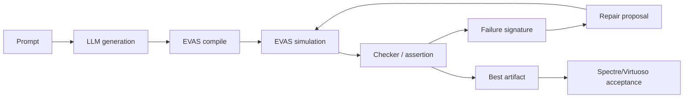
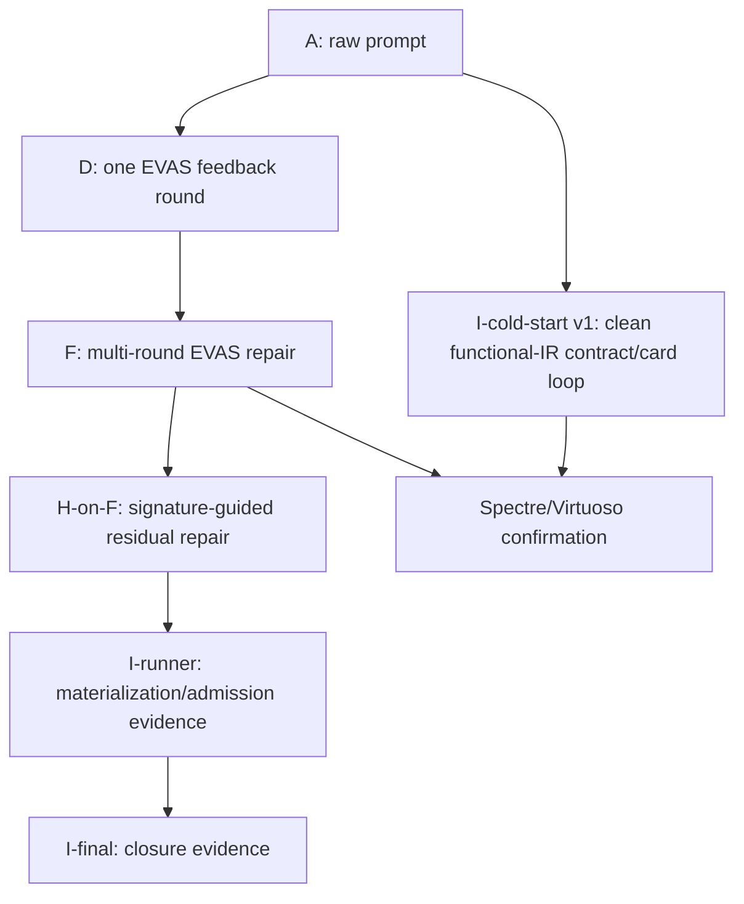
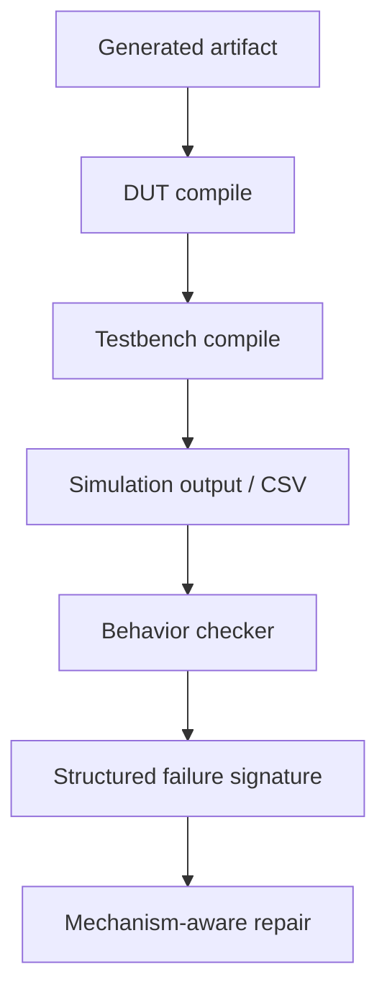
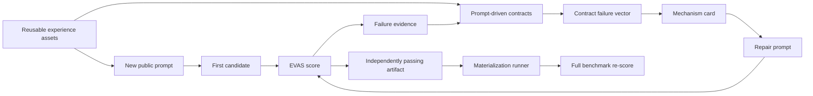

# vaEvas：面向 LLM 生成 Verilog-A 行为模型的 EVAS 快速闭环修复框架

状态：中文论文草稿，更新于 2026-04-29。

这版草稿用于统一论文叙事。它不再只把 `vaEvas` 写成一个“框架/benchmark 整理项目”，而是把核心贡献放在：**EVAS 与 Spectre/Virtuoso 在电压域行为任务上保持一致且更快，因此可以作为 LLM 生成 Verilog-A 的高吞吐仿真反馈引擎。** 这带来两条主线：第一，EVAS 可以作为闭环修复的低成本反馈源，提高生成正确性并降低验证成本；第二，EVAS 可以作为后期训练/强化式优化的数据引擎，低成本地产生 verified trajectories、机制模板和偏好数据。

英文对应稿：[VAEVAS_OPENLLM_STYLE_DRAFT.md](/Users/bucketsran/Documents/TsingProject/vaEvas/coordination/docs/paper/VAEVAS_OPENLLM_STYLE_DRAFT.md)

结果状态索引：[EXPERIMENT_RESULT_LEDGER.md](/Users/bucketsran/Documents/TsingProject/vaEvas/coordination/docs/benchmark/EXPERIMENT_RESULT_LEDGER.md)

清理后的条件矩阵：[CLEAN_EXPERIMENT_CONDITION_MATRIX.md](/Users/bucketsran/Documents/TsingProject/vaEvas/coordination/docs/benchmark/CLEAN_EXPERIMENT_CONDITION_MATRIX.md)

---

## 摘要

大语言模型已经能够生成看起来合理的 Verilog-A 代码，但直接文本生成对模拟/混合信号行为模型仍然不可靠：生成结果可能存在语法错误、testbench/harness 不匹配、不可观测输出，或者虽然能够仿真却不满足目标行为。Spectre/Virtuoso 可以作为工业级仿真验证工具发现这些问题，但其运行成本较高，不适合作为多轮 LLM 修复和大规模候选筛选的内层循环。本文提出 `vaEvas`，一个基于 EVAS 的 Verilog-A 可执行评测与闭环修复框架。核心观察是：在本文关注的电压域行为建模任务中，EVAS 能够与 Spectre/Virtuoso 在行为判断上保持一致，同时具有更快的仿真速度，因此可以支撑高吞吐的“生成-仿真-检查-修复”循环。在 `vaEvas` 中，每个候选模型都会经过编译、EVAS 仿真、行为 checker 判断，并将失败信息结构化为可用于修复的反馈。本文围绕这一特性展开两层贡献：第一，使用 EVAS 作为闭环反馈源，通过 A/D/F/G/H/I 条件矩阵验证 executable feedback 是否能提高正确性并降低验证成本；第二，利用 EVAS 的低成本仿真能力，把 gold/R26 修复经验转化为可参数化机制模板，为后续 supervised fine-tuning、reinforcement-style repair 和偏好数据构建提供 verified teacher signal。当前结果已经按 result ledger 分层：clean A/D/F/G/H/I 结果用于主表或增量分析，I-runner、R26 final admission 和 gold/R26 template generalization 用于工程准入与 teacher-data 证据。整体结果支持本文主张：快速且行为一致的可执行反馈，是提升 LLM Verilog-A 生成可靠性和构建高质量后训练数据的关键基础。

## 1. 引言

Verilog-A 行为模型在模拟与混合信号设计流程中非常重要。工程师会用它描述 PLL、ADC/DAC、校准环路、相位检测器、信号源以及混合信号控制逻辑。虽然现代 LLM 可以生成语法上看似合理的代码，但 Verilog-A 的正确性不是文本层面的属性。一个模型是否有用，必须看它能否编译、能否和 testbench 正确连接、能否产生可观测波形、以及是否满足任务行为。

这使得 Verilog-A 生成比普通代码生成更难评测。生成代码可能看起来没有问题，但内部存在事件调度错误、计数节拍 off-by-one、输出无活动、码字覆盖不足、锁定失败、或者使用了仿真器不兼容的写法。因此，一个可靠 benchmark 不能只比较文本，也不能只看语法，而必须要求可执行证据：编译结果、仿真波形、行为检查以及仿真器一致性。

最直接的方式是把所有候选都放到 Spectre/Virtuoso 中验证。但这对于闭环修复太慢。LLM 修复不是一次仿真，而是需要不断生成候选、运行仿真、读取失败信息、再次修复。只有当仿真足够快时，这个循环才现实可行。

这就是 EVAS 在本文中的角色。EVAS 不是简单替代 Spectre 的工具，而是一个快速行为反馈引擎。它可以快速编译和仿真 LLM 生成的 Verilog-A，输出 CSV/波形结果，并通过 checker 生成结构化失败信息，使 LLM 可以基于真实执行结果进行修复。

本文核心观点是：

> EVAS 与 Spectre/Virtuoso 行为一致，同时速度足够快，因此可以把仿真验证放入 LLM 生成 Verilog-A 的闭环修复过程中。

这个观点直接给出两条论文主线。第一条是**推理时闭环修复**：用 EVAS 替代 Spectre 作为内层反馈，每一轮把真实编译错误、波形缺失、行为 checker 失败和机制级 failure vector 反馈给 LLM，再用 Spectre/Virtuoso 做最终验收。第二条是**训练数据构建**：因为 EVAS 可以快速验证大量候选和参数扰动，它不仅能救当前任务，还能低成本地产生“失败轨迹、修复轨迹、机制模板、通过/不通过偏好对”，这些数据可以用于后续 SFT、DPO/RLHF 风格的偏好学习，或作为机制卡片/RAG 的数据源。

本文贡献包括：

1. 构建一个 92 任务的 Verilog-A 可执行评测 benchmark，包含 prompt、生成代码、testbench、runner 和三层评分：DUT 编译、testbench 编译、仿真行为正确性。
2. 提出 EVAS-guided closed-loop repair，将 EVAS 仿真结果转化为 LLM 可用的修复反馈。
3. 给出 A/D/F/G/H/I 条件矩阵，区分裸生成、公开 Verilog-A 规范、单轮 EVAS 修复、多轮 EVAS 修复、编译清洁层、signature-guided repair 和 contract/mechanism-card repair，用于分析 executable feedback 的增益来源。
4. 探索 signature-guided repair、contract-aligned assertion feedback、functional IR、可复用机制卡片和经过一致性验证的 fast checker，说明更结构化的失败反馈可以继续提高闭环质量；工程准入/closure 结果单独保存，不混入 cold-start 主结果。
5. 展示 EVAS 作为低成本 teacher-data engine 的可行性：从 gold/R26 已验证 artifact 中抽取类型级机制模板，并通过参数扰动验证其是否具备跨数值、跨激励条件的泛化能力。

当前草稿先报告 EVAS 侧结果，因为 EVAS 是快速迭代的基础。最终论文还需要加入 Spectre/Virtuoso 验收结果，证明 EVAS 中的提升不是只在 EVAS 上成立。

## 2. 背景与动机

### 2.1 为什么 Verilog-A 生成必须可执行评测

在 VerilogEval、VGen、RTLLM、OpenLLM-RTL 等 RTL benchmark 中，一个重要共识是：HDL 生成不能只看文本相似度，而应该通过语法检查和 testbench 执行判断功能正确性。这个思想同样适用于 Verilog-A，但 Verilog-A 还额外包含模拟行为、事件时序和仿真器语义。

Verilog-A 的特殊困难包括：

1. 事件触发、transition、timer、cross 等时序语义会影响行为；
2. checker 是否能读到结果依赖 save policy 和可观测信号；
3. 不同仿真器对部分 Verilog-A 写法的支持和语义可能不同；
4. 很多任务涉及锁定、重捕获、采样、量化、节拍、码字覆盖等行为指标。

因此，`vaEvas` 的基本原则是 execution-first。只有当候选代码编译成功、仿真成功、并通过行为 checker 时，才认为任务成功。

### 2.2 EVAS 作为快速行为反馈引擎

EVAS 的价值不是“比 Spectre 更方便”，而是“快到可以进入闭环”。Spectre/Virtuoso 仍然是最终工业级验收标准，但 EVAS 负责在优化过程中提供高吞吐反馈。

EVAS 之所以能作为快速内层循环，来自它和 Spectre/Virtuoso 的求解目标不同。Spectre/Virtuoso 是 SPICE-class 电路仿真器，通常需要根据器件、电流贡献、KCL/KVL 关系构造并求解改进节点分析（MNA）矩阵，并在非线性器件和连续时间动态中进行迭代求解。EVAS 则有意收窄到 **event-driven voltage-domain behavioral Verilog-A**：它把支持范围限定在 `V(node) <+ ...`、`V(a,b) <+ ...`、`cross()`、`above()`、`timer()`、`transition()` 等行为建模常用结构上，将节点值作为电压状态更新和采样，而不是求解完整电路网络的电流守恒方程。

因此，EVAS 的速度优势不是免费的。它的代价是明确的适用边界：EVAS 不声称替代任意 SPICE 仿真，也不处理一般电流域贡献、器件级 KCL/KVL、`ddt()`/`idt()`/Laplace 连续时间算子、噪声谱模型或强依赖负载效应的模拟网络。换句话说，EVAS 牺牲了完整电路求解能力，换来了对纯电压域行为模型的快速执行能力。

这个取舍正好匹配我们的 benchmark 目标。大部分 LLM Verilog-A 行为建模任务关心的是功能行为：例如输出码字是否覆盖、分频节拍是否正确、PFD 脉冲窗口是否合理、PLL 是否锁定、testbench 是否能读到目标信号。此时我们通常不关心真实电流负载、器件 I-V 曲线或完整电路网络的电流分配。因此，只要任务被限定在纯电压域行为模型范围内，EVAS 就可以作为快速且可信的闭环仿真代理；最终关键结果再通过 Spectre/Virtuoso 验收确认。

| EVAS 设计取舍 | 带来的速度优势 | 损失/边界 |
|---|---|---|
| 事件驱动执行 `cross/timer/above` | 只在时间步和事件断点附近更新行为状态 | 不等价于 Spectre 的完整 LTE/连续时间求解 |
| 纯电压域 `V() <+` 行为贡献 | 直接更新/读取节点电压状态，避免 MNA 矩阵求解 | 不支持一般 `I() <+` 电流贡献和 KCL 网络求解 |
| 行为级 `transition/slew/last_crossing` 近似 | 快速生成可观测波形和边沿事件 | 不声称覆盖所有模拟算子精确语义 |
| 面向 benchmark 的 CSV/checker 输出 | 适合批量自动化评分和 LLM repair | 依赖明确 observable contract 和 save policy |

完整证据链应该是：

1. 证明 EVAS 和 Spectre/Virtuoso 在代表性任务上的行为判断一致；
2. 证明 EVAS 在相同输入下比 Spectre/Virtuoso 更快；
3. 使用 EVAS 进行多候选、多轮次的闭环修复；
4. 最后把关键结果放回 Spectre/Virtuoso 中确认。

如果 EVAS 只是快但行为不一致，它的反馈不可信；如果 EVAS 行为一致但不够快，它无法支撑多轮修复。因此论文必须同时证明“一致”和“快”。

这一点也决定了本文的实验叙事。A/D/F/G/H/I 表不是单纯比较 prompt engineering 技巧，而是在比较不同程度的 EVAS 反馈如何改变生成过程：A 表示没有执行反馈，D/F 表示把 EVAS 结果放入一次或多次修复，G 进一步强调编译/接口/产物错误应该被尽早归零，H/I 则把 EVAS 输出从一句错误信息提升为 signature、contract 和机制卡片。换言之，表格本身要证明的不是“某个提示词更好”，而是“快速一致的执行反馈可以把 LLM 生成从一次性猜测变成可优化过程”。

同样的性质也支撑训练数据构建。Spectre/Virtuoso 更适合最终验收，但如果要产生上千条候选轨迹、修复轨迹、参数扰动样本和 pass/fail 偏好对，直接用 Spectre 作为内层循环成本过高。EVAS 的作用是在保持电压域行为一致性的前提下，把这类大规模 verified data 生成变得可承受；最终少量高价值样本再回到 Spectre/Virtuoso 复核。

### 2.3 与断言验证思想的关系

OpenLLM-RTL 的一个重要启发是：验证质量可能比数据量更重要。它通过断言和形式验证筛选高质量 RTL 数据，说明 verified data 可以比更多 raw data 更有价值。我们的场景不是训练新模型，而是在推理和修复阶段使用 EVAS 反馈。

二者共享的核心思想是：LLM 需要强验证器。不同的是，我们的验证器不仅给出 pass/fail，还会输出结构化失败签名，例如 `tran.csv missing`、码字覆盖不足、计数节拍错误、边沿窗口错误、no-overlap 失败、PLL lock 失败等。这些失败签名是仿真结果和代码修复之间的桥梁。

## 3. Benchmark 与任务契约

### 3.1 任务结构

每个任务包含：

1. 描述目标行为的自然语言 prompt；
2. LLM 生成的 DUT 和 testbench/harness；
3. 描述任务 family、category、期望文件的 metadata；
4. EVAS runner 配置；
5. 任务专属的行为 checker。

当前 benchmark 覆盖四类任务：

| 任务类型 | 作用 |
|---|---|
| End-to-end | 生成完整 Verilog-A DUT 和 testbench。 |
| Spec-to-VA | 从规格式描述生成 Verilog-A。 |
| Bugfix | 修复已有错误 Verilog-A。 |
| TB generation | 生成或修复 testbench/harness。 |

当前正式矩阵使用 92 个任务。早期 76 任务统计应视为历史记录，后续需要刷新。

### 3.2 评分方式

每个任务通过三层 gate：

1. `dut_compile`：DUT 是否能编译；
2. `tb_compile`：testbench/harness 是否能编译和执行；
3. `sim_correct`：EVAS 仿真结果是否满足任务 checker。

最终 `Pass@1` 要求任务所需 gate 全部通过。失败会归因到 DUT 编译失败、testbench 编译失败、仿真行为错误、timeout、CSV 缺失、checker 覆盖不足等类别。

### 3.3 prompt 公开契约与避免泄露 gold

prompt 应该公开任务成立所必需的信息，例如接口、可观测输出、必要行为指标；但不应该泄露 gold 实现或具体答案。这个平衡与 OpenLLM-RTL 对 benchmark 描述详细程度的讨论一致：描述过少会导致任务不明确，描述过多会变成代码翻译。

我们的原则是：

1. prompt 应公开接口、观测信号和核心行为契约；
2. prompt 不应公开 gold 代码结构或任务专属模板；
3. repair 阶段可以使用通用电路知识和失败签名；
4. signature-guided template 只能由失败证据触发，不能按任务名触发。

这里的“契约”不是把 checker 代码或 gold 实现泄露给模型，而是把任务成立所必需的行为指标上升为公开规格。例如，如果 checker 最终要判断 divider 的输出节拍、ADC 的码字覆盖、PFD 的脉冲窗口或 PLL 的锁定行为，那么这些指标应该以自然语言或结构化 spec 的形式出现在任务契约中。后续的 assertion-style checker 再把这些公开契约变成可执行断言，用于 EVAS 仿真后的失败定位。

## 4. 方法：EVAS 引导的闭环修复

### 4.1 总体流程

闭环流程如下：

```text
Prompt -> LLM 生成 -> EVAS 编译/仿真 -> checker/assertion
       -> 结构化失败签名 -> 修复候选 -> EVAS 重新验证
       -> 选择最佳候选 -> 可选 Spectre/Virtuoso 验收
```

这个流程不同于静态 prompt engineering。它不是单纯告诉模型更多知识，而是用真实仿真结果决定下一步修复。它也不同于 random retry，因为每次额外尝试都基于 EVAS 反馈，而不是盲目重采样。

### 4.2 EVAS 反馈层次

EVAS 反馈可以分为几层：

| 反馈层 | 例子 | 修复价值 |
|---|---|---|
| 语法/兼容性 | 不支持语法、编译错误 | 避免模型继续使用无效写法。 |
| harness/observable | `tran.csv` 缺失、信号未保存、没有边沿 | 判断问题在 DUT、TB 还是观测契约。 |
| 行为 checker | 码字覆盖不足、节拍不对、lock 失败 | 指出具体违反了哪个行为目标。 |
| 失败签名 | `interval_hist`、`only_N_codes`、`not_enough_edges` | 将反复出现的问题映射到通用修复机制。 |

在把失败反馈交给 LLM 之前，闭环还需要增加一个更早的失败归因层：先判断这是**功能失败**还是**验证失败**。功能失败指 DUT/TB 已经编译、EVAS 已经产生可信 waveform，并且 checker 给出了明确行为不匹配；这类失败才应该进入电路行为修复。验证失败指 checker、仿真 runtime、CSV 文件、timeout、接口连接、save policy 或 scoring schema 阻断了可信行为判决；这类失败应先修 checker/harness/scoring pipeline，或者只让 LLM 修语法和接口，而不是让它盲目改电路算法。这个二分来自本轮 full92 关闭过程中的教训：若不区分二者，LLM 会把 checker timeout 或大 CSV 读取问题误解成电路功能错误。

### 4.3 主条件矩阵

论文主线应优先报告 cold-start 或接近 cold-start 的条件，也就是从公开 prompt 和统一 runner 出发自动生成、仿真、修复、评分的结果。当前最干净的主线条件是：

| 条件 | 含义 | 回答的问题 |
|---|---|---|
| A | fair public-spec baseline | 给出公开接口、语法和 observable 要求后，模型能做到什么程度？ |
| D | 从 A 出发的单轮 EVAS repair | 一次仿真反馈是否有帮助？ |
| F | 从 A 出发的多轮 EVAS repair | EVAS 的速度是否能支撑更有效的多轮优化？ |
| I | 从 A 出发的 no-leak contract/card repair | 公开行为契约、功能 IR、可执行断言和机制卡片能否形成真正端到端 cold-start 闭环？ |
| H-on-F | 从 F 出发的 signature-guided 增量修复 | 更结构化的失败反馈能否在同一起点上继续提升？ |

其他条件作为辅助对照：

| 对照 | 作用 |
|---|---|
| 同预算 random retry | 排除“只是因为多调用了 LLM”的解释。 |
| static skill-only / checker-transparent prompt | 检验静态知识是否可以替代 EVAS 动态反馈。 |
| H ablation | 证明 H 不是按任务名过拟合，而是按失败签名触发。 |
| I-runner / I-final | 保存工程准入、materialization 和 closure 能力，但不作为 cold-start 主结果。 |

### 4.4 Signature-guided repair

H 条件不是为每个 benchmark 写死答案，而是使用可复用的失败机制：

| 模板族 | 触发依据 | 目标问题 |
|---|---|---|
| counter cadence/off-by-one | interval/count mismatch | 分频器、timer、计数周期。 |
| sampled latch/reset priority | sample/reset edge mismatch | DFF、采样保持、边沿触发逻辑。 |
| quantizer/code coverage | only_N_codes、reversal | ADC/DAC 量化器。 |
| onehot/thermometer/no-overlap | overlap、missing selection、wrap failure | DWA、温度计码、one-hot 选择。 |
| frame/sequence alignment | frame/sequence mismatch | serializer、PRBS、LFSR。 |
| PLL/PFD timing window | lock、pulse width、phase window | PLL、PFD、lock/reacquire。 |
| multi-module interface sanity | CSV 缺失、子模块无输出 | 多模块接口和 harness。 |

只有当某个模板族在多个不同任务中都能 rescue，才应该升级为论文正式方法；如果只救单个例子，则作为探索性结果记录。

### 4.5 Contract-aligned assertion-guided repair

当前正在优化的下一层方法，可以暂记为条件 I。它试图解决 H 的一个核心不足：失败签名虽然比 pass/fail 更有信息量，但有时仍然没有明确说明“违反了哪条任务契约”。因此，I 条件把任务公开契约、functional IR、assertion-style checker 和机制卡片绑定起来。

这里必须区分三类 I 结果：

1. **I-cold-start v1**：v0 已降级为 pipeline smoke；v1 需要从 clean A 原始生成失败集、公开 prompt、完整 contract 覆盖、自动修复、自动验证、自动准入串成最有说服力的正式目标。
2. **I-on-F / I-on-H**：从已有 F 或 H 失败集继续修，是增量 ablation，用来判断某个机制是否比 H 更有帮助。
3. **I-runner / I-final**：把局部已验证 PASS artifact 自动 materialize 到 full92 并复跑，属于工程准入/closure 证据，不等同于 cold-start。

流程上，I 条件包含三步：

1. **公开契约层**：在 prompt 或任务 spec 中明确必须满足的接口、可观测信号、行为指标和仿真窗口，但不泄露 gold 实现。
2. **可执行断言层**：把这些公开契约转化为 EVAS 可执行 checker/assertion，例如码字覆盖、节拍比例、脉冲宽度、锁定窗口、序列对齐等。
3. **修复反馈层**：当 EVAS 仿真失败时，不只返回笼统错误，而是返回违反的契约项、观测到的数值、目标范围和可疑模块/信号区域。

这个方向和 OpenLLM-RTL 中“断言用于验证质量”的思想一致，但作用位置不同：OpenLLM-RTL 主要用断言筛选训练数据，我们这里用契约对齐的断言作为闭环修复反馈。I 条件不把 hidden checker、gold trace 或任务答案暴露给模型；它只把公开 prompt、公开可观测信号和仿真后可测得的失败向量转化为更细的修复目标。

进一步地，I 条件中的“断言”不应只停留在单个输出信号检查，而应扩展为系统级关系图。以 PLL 为例，正确性来自 reference、feedback、DCO、divider、lock window 和控制量之间的关系；以 ADC 为例，正确性来自 sample/hold、quantizer、SAR control、DAC/CDAC reconstruction、pipeline residue 和 calibration/trim 之间的关系。这样的关系图可以把一个笼统失败拆成机制级 failure vector：例如 ADC-DAC round trip 中，采样时钟存在但 code coverage 不足、code 覆盖足够但重构误差过大、CDAC 差分摆幅存在但 ready/settled 不出现，分别对应不同修复方向。这种表达比按任务名写模板更安全，因为它从公开 prompt、可观测信号和仿真指标出发，而不是从 benchmark 文件名出发。

### 4.6 经验沉淀与冷启动闭环

`vaEvas` 中的“经验”不应理解为把本地已经通过的任务代码保存下来，也不应理解为为每个 benchmark 手写一个专属 `contracts.json`。可迁移的经验被限制在四类资产中：

1. **Verilog-A skill**：通用写法、EVAS 兼容边界、事件/transition/timer 使用规则；
2. **contract 类型库**：例如 `edge_count`、`output_span`、`code_coverage`、`frequency_ratio`、`paired_edge_response`、`differential_range`；
3. **prompt 机制识别规则**：从公开 prompt 和可观测信号中识别 ADC/DAC、PFD、PLL、serializer、Gray counter 等机制族；
4. **机制卡片**：把 contract failure vector 映射到通用修复策略，例如“输入活动存在但 code/output 不动”对应 ADC-DAC 量化与重建链路修复。

因此，一个全新环境不需要预先拥有当前本地 `results/` 历史才能使用闭环。冷启动流程是：

```text
公开 prompt + 通用 skill/机制模板
  -> 首轮生成与 EVAS 评分
  -> 得到 result.json、notes、tran.csv、compile log
  -> 从 prompt/公开信号/失败证据生成 contracts.json
  -> contract_check 得到机制级 failure vector
  -> 选择机制卡片并生成下一轮 repair prompt
  -> 重复评分，独立 PASS 后进入 candidate pool
  -> materialization runner 合并并复跑 full benchmark
```

这条路径把“经验”用作定位和修复的先验，而不是直接替换答案。没有历史结果时，第一轮只能依赖 prompt-driven contracts 和通用 skill；跑过一轮后，闭环会产生自己的失败证据，从而进入更强的 instance-specific repair。这个设计也是避免过拟合的关键：新增知识应按机制族扩展，而不是按任务名扩展。

### 4.7 机制卡片的语义泛化与防过拟合

机制卡片要成为论文中的正式方法，必须证明它不是在记忆 benchmark 字符串。因此，我们进一步把 card selection 从“任务名/精确关键词触发”改为“公开 prompt 语义 + 端口角色 + functional IR + contract failure vector 触发”。具体来说，系统先从 prompt 中抽取功能关系，再把功能关系映射到机制模板，最后由失败向量选择机制卡片；任务名只作为文件系统索引，不作为行为证据。

这个设计需要处理三个实际问题：

1. **数值变化**：同一机制可能有不同位宽、步进、电压幅度、重复次数或时间窗口。例如 thermometer DAC 的 `vstep` 可以从 `1.0` 变成 `0.25`，Gray counter 可以从 4 bit 变成 5 bit。
2. **命名变化**：同一信号可能叫 `din`、`dinp`、`therm_in`、`code`、`clk_i` 或 `edge_data`。系统不能只匹配某个固定端口名，而应结合端口方向、bus 结构和语义别名。
3. **语言变化和拼写错误**：用户可能把 `monotonic` 写成 `monotocin`，或者用“population count”“count of ones”“unary code”等近义表达。系统需要有轻量的规范化、近似匹配和否定短语处理，避免把 “not a thermometer DAC” 误判为 thermometer DAC。

因此，当前实现加入了四类防过拟合规则：第一，prompt 词汇先经过规范化和近似匹配，使轻微拼写错误仍能落到正确机制；第二，信号名通过端口角色、bus 前缀和别名归一化，例如 `dinp[9:0]` 可以被识别为输入码字；第三，加入反例规则，例如 “not thermometer/unary” 不触发 thermometer DAC 卡片，“no parameter override” 不触发参数覆盖卡片，PFD 不触发 BBPD data/clock lead-lag 卡片；第四，引入轻量 functional IR，把“输入字更大时输出电压不能更低”“输出等于高电平控制数量乘以单位步进”“data 边沿早于/晚于 clock 时产生 UP/DN pulse”等句子抽成 `ordered_transfer`、`count_high_to_analog`、`data_clock_lead_lag_pulses` 等功能关系。

这一步仍然不是 LLM 修复 pass-rate 结果，而是一个机制泛化检查：只有当卡片能在数值扰动、命名扰动、结构扰动、功能改写和反例 prompt 上保持正确触发，才可以进入下一步 no-leak repair replay。

### 4.8 EVAS 作为后训练数据引擎

除了推理时修复，EVAS 的另一个价值是让后训练数据构建变得便宜。对 Verilog-A 这类任务来说，训练数据的关键不是“更多文本”，而是“带可执行验证标签的轨迹”：哪些候选能编译、哪些候选能仿真、哪些候选虽然语法正确但行为失败、哪一次修复把 `only_2_codes` 变成 full code coverage、哪一个机制模板在改变参数后仍能通过。这些都是普通静态语料很难提供的信息。

因此，本文可以把 EVAS 产生的数据分成四类：

| 数据类型 | 来源 | 可能用途 |
|---|---|---|
| pass/fail preference pair | 同一 prompt 下多个候选的 EVAS/checker 结果 | DPO/RLHF 风格偏好学习，训练模型偏向可执行正确代码。 |
| repair trajectory | 失败 artifact、EVAS 反馈、修复 prompt、下一轮结果 | SFT 训练“如何根据仿真反馈修复”。 |
| mechanism template | gold/R26 artifact 抽象出的类型级写法 | 机制卡片、RAG、代码 skeleton 或 curriculum。 |
| parameterized variants | 改变周期、码字、VDD、窗口、位宽后的重新验证 | 防止模型只记住 benchmark 数值，检验类型级泛化。 |

这也解释了为什么 R26/92 全修复仍有工程价值。它不应被当作 cold-start pass-rate 宣称，但可以作为 teacher-data source：从已经通过的 artifact 中提取“PLL feedback cadence 如何保持”“DWA pointer/window 如何耦合”“PFD UP/DN pulse 如何互斥”“ADC/DAC quantize-reconstruct 如何保持一致”等机制写法。我们新增的 gold/R26 template generalization 实验正是沿着这条线进行：从 R26 已验证 artifact 中抽取 4 类机制模板，改变关键参数后重新 EVAS 验证，当前 14/14 参数扰动变体通过。这个结果说明历史闭合经验至少在部分机制上可以转化为可迁移 teacher signal，而不仅是针对单个 benchmark 的补丁。

### 4.9 面向电路机制的 RAG 扩展

当前机制卡片是一个可审计的中间层：它把 EVAS/contract failure vector 翻译成短的 repair guidance。但如果系统继续发展，机制卡片不应停留在手写规则库，而应升级为 **Circuit-Mechanism RAG** 中的结构化知识节点。也就是说，未来的检索对象不是任务名，也不是单个关键词，而是 prompt、端口角色、可观测信号、EVAS 失败向量和电路功能关系共同构成的机制图。

一个更完整的 RAG 知识库可以分成三层：

| 知识层 | 内容 | 作用 |
|---|---|---|
| 电路知识层 | ADC、PLL、PFD、DWA、SAR、CDAC、calibration 等电路原理和子模块关系 | 帮助模型理解系统级约束，而不是只看单个输出信号。 |
| 机制模板层 | `quantize-reconstruct`、`feedback-divider-lock`、`pointer-window-enable`、`edge-order-pulse` 等可迁移关系 | 把电路原理压缩成可复用的实现约束。 |
| 失败轨迹层 | EVAS notes、contract failure vector、失败代码形态、成功修复策略 | 根据真实失败选择最相关的修复经验。 |

检索流程可以表示为：

```text
public prompt + ports + EVAS notes/tran.csv
  -> functional IR / circuit relation graph
  -> retrieve similar mechanisms, failures, and verified variants
  -> compress retrieved evidence into mechanism-card guidance
  -> LLM repair
  -> EVAS verify
  -> write back successful/failed trajectory
```

在这个框架下，机制卡片仍然有价值，但它的角色发生变化：它不是最终知识库，而是检索结果的可控摘要格式。RAG 可以负责召回更丰富的电路知识、gold/R26 机制模板、参数扰动经验和失败轨迹；机制卡片负责把这些材料压缩为不会泄露 gold 实现、不会过度膨胀 prompt、并且能被消融审计的 repair hint。这个方向也能缓解当前规则 selector 的局限：从关键词匹配逐步转向功能图匹配和相似失败轨迹匹配。

初步 RAG pilot 说明这个方向需要同时验证“检索正确”和“修复有效”。在 23 个 no-API 检索 case 上，加入 functional IR、R26 机制节点和 DWA guard 后，positive case 的 top-3 机制召回达到 20/20，但仍存在 5/23 forbidden top-3，说明最终注入 prompt 前仍需要严格的 negative guard。随后在最终 G 剩余失败中选取 8 个任务进行真实 repair，RAG-diverse 版本救回 `dwa_ptr_gen_no_overlap_smoke`：G baseline 为 `FAIL_SIM_CORRECTNESS`，RAG 第 1 轮把行为推进到 `max_active_cells=8, overlap_count=7`，第 2 轮达到 `overlap_count=0` 并通过 EVAS；修复 save-continuation staging bug 后，标准 EVAS 与真实 Spectre strict 均 PASS。同样配置但关闭 RAG 的 DWA 对照在 2 轮内仍未 PASS。这个结果只能作为 pilot evidence：RAG 不是检索到机制就必然修复，但它已经展示出把 R26/system relation 知识转化为真实新增 PASS 的可能。

在此基础上，我们进一步把 R26/92PASS 经验从“机制摘要”推进为 `Circuit-Mechanism Skeleton` 层。当前 skeleton 库覆盖 DWA pointer-window、ADC-DAC quantize-reconstruct、PFD edge-pulse 和 PLL feedback-cadence 四类机制，每个 skeleton 包含 slot schema、implementation skeleton、Verilog-A shape 和 anti-pattern。RAG 注入时优先召回 skeleton，再召回 R26 template、repair card 和 prompt template。小规模实验显示，Skeleton-RAG 仍在 8 个 G-fail 任务中救回同一个 DWA case，标准 EVAS 与 Spectre strict 均 PASS，但还没有额外救回 PLL/ADC/PFD。这个结果说明 skeleton 层是必要的结构化中间表示，但当前仍偏 generic；后续需要升级为 slot-bound skeleton generator，自动绑定端口名、参数名、位宽、reset polarity、保存节点和 metric gap。

## 5. 实验设置

### 5.1 模型

当前主实验使用 Kimi 作为主要模型。Qwen 作为跨模型对照。其他模型尝试如 GLM、MiniMax 等目前应作为历史诊断，不建议放入主故事，除非用当前系统重跑。

后续需要保留一张多模型对比表，用来回答“这个系统是否只对某一个模型有效”。这张表的重点不是证明某个模型绝对最好，而是观察不同模型在同一套可执行闭环系统下的错误类型、修复收益和 Spectre/Virtuoso 转移情况。

| 模型 | 条件 A：裸 prompt EVAS | cold-start 闭环结果 | Spectre/Virtuoso 验收 | 主要失败类型 | 备注 |
|---|---:|---:|---:|---|---|
| Kimi | current clean A R3: 40/92；current 20/92 已降级 | current F: 61/92; H-on-F: 65/92 为 F 后增量 | TBD | 行为错误为主 | 2026-04-27 current-regression A/B/C 被 placeholder 污染；R3 是当前 prompt-only 单次 clean 观测，2026-04-28 runner/checker rescore 后为 40/92；I-cold-start v0=58/92 仅作 pipeline smoke。 |
| Qwen | clean-candidate: 25/92；current: 26/92 | F: 28/92; G current 样本不完整 | TBD | 验证/接口失败占比更高 | 尚未建立 Qwen 版 H/I final。 |
| GPT-5.5/API model | TBD | TBD | TBD | TBD | 需要后续 API 或可复现实验入口。 |
| 其他模型 | TBD | TBD | TBD | TBD | 仅在当前系统下重跑后纳入正式表。 |

### 5.2 指标

主要指标：

1. `Pass@1`；
2. 92 个任务中的通过数量；
3. family-level pass rate；
4. 失败类型归因；
5. Spectre/Virtuoso 最终验收结果。

辅助指标：

1. EVAS 运行时间；
2. Spectre/Virtuoso 运行时间；
3. EVAS-Spectre 行为一致率；
4. repair 的 eligible_count、rescued_count、unsupported_count；
5. prompt-only baseline 的重复运行均值、标准差、95% 置信区间和 per-task flip rate。

由于 LLM 生成不是严格确定性的，即使 API 参数设置为 `temperature=0`，服务端模型版本、解码 tie-break、截断边界和批处理顺序也可能影响具体代码轨迹。因此 A 类 prompt-only baseline 不能只用一次运行解释为稳定能力边界。论文主表可以先报告最新 clean snapshot，但最终统计应对**同一版 prompt**做多次 fresh-root 重跑：报告 `mean ± std`、bootstrap 或 Wilson 置信区间、每个任务在多次运行中的 PASS/FAIL 翻转率。不同 prompt snapshot 之间的差异只能用于 prompt 审计，不能直接当作模型方差。

### 5.3 当前系统配置

最新系统包含：

1. 并行评分时每个任务独立 EVAS 输出目录；
2. fingerprinted resume cache；
3. contract-based save policy；
4. 默认启用经过 parity 验证的 fast checker；
5. DFF checker 采样窗口修复；
6. streaming checker，避免大 CSV 行为检查超时误伤；
7. 功能失败/验证失败归因 gate；
8. prompt 机制识别中的 typo/alias/否定短语处理；
9. signature-gated H 原型、functional-IR contract/card 组件、contract/materialization runner 与 R26 final admission；其中 runner/final admission 作为工程准入证据，不作为 cold-start 主结果。

## 6. 实验结果

### 6.1 当前 EVAS 主矩阵

当前结果先按证据类型分层。2026-04-27 Kimi A/B/C current-regression 已确认由 placeholder-contaminated generated root 造成，因此不进入 clean 主矩阵；下面保留这些数字只是为了说明为什么必须重跑。

| 条件 | 描述 | Pass@1 | 通过数量 | 证据类型 |
|---|---|---:|---:|---|
| A/B/C current Kimi | 裸 prompt / checker / checker+skill | mixed | 20/92, 29/92, 29/92 | invalid-baseline：dry-run placeholder 污染 |
| A current clean R3 Kimi | prompt-only generic prompt hygiene snapshot, runner/checker-fixed rescore | 0.4348 | 40/92 | clean-candidate 单次观测；需要重复运行统计不确定性 |
| D | 单轮 EVAS repair，无 skill | 0.5978 | 55/92 | cold-start repair |
| E | 单轮 EVAS repair + skill | 0.5870 | 54/92 | ablation |
| F | 多轮 EVAS repair，无 skill | 0.6630 | 61/92 | 当前最干净 cold-start 闭环主结果 |
| G | 多轮 EVAS repair + skill | 0.6304 | 58/92 | ablation，样本不完整 |
| H-on-F | signature/contract-guided H-on-F 原型 | 0.7065 | 65/92 | 从 F 出发的增量修复 |
| I-cold-start v0 | functional-IR/contract/card repair from A | 0.6304 | 58/92 | provisional：A anchor 污染，仅作 pipeline smoke |
| I-runner | contract materialization runner | 0.8043 | 74/92 | 自动准入/合并证据 |
| I-final | R26 final admission 合并集 | 1.0000 | 92/92 | closure 证据，不是 cold-start |

最清楚的趋势是：静态 prompt 清理可以消除污染和接口歧义，但不能把单次 pass-rate 改变直接解释为稳定提升；真正的大幅提升来自 EVAS 仿真反馈。
其中 G 使用历史生成目录，Kimi 只有 91 个 sample，Qwen 只有 36 个 sample，因此 G 更适合作为辅助 ablation，而不是主结论条件。

### 6.2 Prompt-only A 的当前口径

当前最新 prompt baseline 是 `A current clean R3`：`40/92`，Pass@1=`0.4348`。它使用 generic prompt-hygiene 后的官方 `tasks/**/prompt.md`，没有 checker injection、skill injection 或 EVAS feedback；生成目录中 `dry_run=0`、placeholder artifact 为 0，`tb-generation=11/11`。该数字来自 2026-04-28 对同一批 R3 生成物的 runner/checker-fixed rescore；因此，R3 是当前论文叙事里应采用的最新 A snapshot。

真正需要统计化的是：在固定 R3 prompt、固定 runner 和固定 public-spec 配置后，做多次 fresh-root 生成，观察 `40/92` 附近的均值、标准差、置信区间和 per-task flip rate。不同 prompt snapshot 的历史结果只用于审计 prompt 清理过程，不进入主线比较。

R3 的主要意义是把 A baseline 从“污染/包装不清”的状态收敛到一个可引用的 clean prompt-only 起点。它仍然是单次观测，不应被写成最终稳定数值；但在下一轮 clean B/C/D/F/I 重跑之前，R3 是当前最合适的 A baseline。

### 6.3 论文主表建议：cold-start 优先

主故事建议用 clean A/D/F 作为 cold-start 主结果，H-on-F 作为增量修复证据。I-runner 和 I-final 可以保存，但应放在“工程准入/closure”表中，而不是和 cold-start 结果并列宣称。I-cold-start v0 现在只能说明 pipeline 已经打通，不能作为正式 cold-start pass-rate。

| 条件 | 通过数量 | 支撑结论 |
|---|---:|---|
| A | 40/92 current clean R3；20/92 invalid current | 裸 LLM 生成不可靠；R3 是当前单次 clean snapshot，最终以同版 prompt 重复 clean rerun 的均值/区间为准。 |
| D | 55/92 | 一次 EVAS 反馈带来显著提升。 |
| F | 61/92 | EVAS 速度支持多轮闭环，进一步提升。 |
| H-on-F | 65/92 | 结构化失败签名和机制契约能在 F 剩余失败上继续 rescue。 |
| I-cold-start v0 | 58/92 provisional | 从 A 原始失败集出发的 functional-IR/contract/card repair pipeline 已跑通；但 A anchor 污染，需 clean rerun。 |

B/C/E/G 可以作为 ablation 或附录，不建议让它们稀释主线。

工程准入和 closure 证据单独报告：

| 结果 | 通过数量 | 正确解释 |
|---|---:|---|
| I-runner | 74/92 | 自动 materialization/admission runner 可以把独立验证的 PASS 修复合入 full92。 |
| I-final | 92/92 | R26 final admission 说明 remaining failures 在工程上已被关闭；它是 closure 上限，不是 cold-start pass-rate。 |

### 6.4 按任务类型的结果

| 条件 | End-to-end | Spec-to-VA | Bugfix | TB generation |
|---|---:|---:|---:|---:|
| A current invalid | 0.1091 | 0.1667 | 0.6250 | 0.5455 |
| A current clean R3 | 0.2727 | 0.3889 | 0.8750 | 1.0000 |
| D | 0.5091 | 0.5000 | 0.8750 | 1.0000 |
| F | 0.6000 | 0.5556 | 0.8750 | 1.0000 |
| H | 0.6364 | 0.6667 | 0.8750 | 1.0000 |
| I-cold-start v0 provisional | 0.5455 | 0.5556 | 0.8750 | 1.0000 |
| I-runner* | 0.7636 | 0.7778 | 0.8750 | 1.0000 |
| I-final* | 1.0000 | 1.0000 | 1.0000 | 1.0000 |

提升最大的是 end-to-end 和 spec-to-VA，因为这些任务中裸生成最容易同时出现编译、连接和行为错误。
星号表示工程准入/closure 结果，不作为 cold-start 主结果。`A current invalid`
和 `I-cold-start v0 provisional` 只保留为污染审计后的参考，不进入最终主表。

### 6.5 失败类型归因

| 条件 | PASS | 功能失败 | 验证/接口失败 |
|---|---:|---:|---:|
| A current invalid | 20 | 45 | 27 |
| A current clean R3 | 40 | 32 | 20 |
| D | 55 | 36 | 1 |
| F | 61 | 29 | 2 |
| H | 65 | 25 | 2 |
| I-cold-start v0 provisional | 58 | 25 | 9 |
| I-runner* | 74 | 16 | 2 |
| I-final* | 92 | 0 | 0 |

这张表说明：EVAS 闭环能显著减少语法、testbench 和验证管线层问题；进入后期后，剩余失败主要是真正的功能行为错误。因此下一步不是简单增加轮数，而是提高失败定位、机制契约和系统关系图质量。
在 A current clean R3 中，`验证/接口失败` 包含 DUT 编译、testbench/runtime 和一个截断导致的 infra case；后续 failure attribution 需要继续把 Spectre/Verilog-A 语法模式、真实 harness 问题和输出截断拆开。星号表示工程准入/closure 结果，不作为 cold-start 主结果。I-cold-start v0 也不再作为正式 cold-start 主结果，因为它继承了污染 A anchor。

### 6.6 H/H2 证据

当前 H-on-F 将正式 Kimi 快照从 F 的 61/92 提升到 65/92。提升来自 failure-signature repair 与机制契约对剩余失败的更细定位，而不是按任务名替换答案。诊断中观察到的 rescue 包括 divider cadence、multimod divider cadence、flash/ADC code coverage、edge liveness 和部分 PFD/PLL window 类问题。

H2 在 H-on-F 剩余失败集上显示，如果结合 generated-testbench repair、经过验证的 fast checker、以及可迁移 DUT template，可以 rescue 更多任务。保守 fast-default H2 在 33 个失败 anchor 上达到 10/33。这还不是 full92 正式条件，但说明下一步方法有潜力。

### 6.7 I：组件证据、准入结果与 cold-start 缺口

I 条件的目标是把“任务契约”和“checker/assertion”对齐，并在修复时使用 functional IR、contract failure vector 和机制卡片。它不应和 B 的 checker-transparent prompt 混淆：B 是在生成前静态暴露更多 checker 信息；I 是在 EVAS 仿真后，用公开契约对应的断言失败来指导 repair。

当前已经完成的是 I 的组件验证、增量修复、工程准入实验，以及一个从 A-kimi current-regression 失败集出发的 I-cold-start v0 replay。事后审计发现该 A root 混入 dry-run placeholder artifact，因此 v0 的 58/92 不能作为正式 cold-start 接入证据，只能说明 I replay/materialization pipeline 可以跑通。74/92 和 92/92 则证明 runner、materialization、系统关系图、机制卡片和 checker 清洗可以共同关闭 full92，但同样不能当作 cold-start 主结果。

需要验证的核心问题包括：

1. I 是否能减少“checker 目标和 prompt 目标不一致”导致的不可修复行为错误；
2. I 是否能把剩余行为错误从笼统 `FAIL_SIM_CORRECTNESS` 变成更可操作的违反项；
3. I 是否能在不泄露 gold 实现的前提下提升 F/H 剩余失败集；
4. I 的提升是否能迁移到 Spectre/Virtuoso 验收结果。

当前实现已经验证了 I 的基础组件是可运行的：

| 组件 | 验证结果 | 含义 |
|---|---:|---|
| prompt 机制识别 | 59/59 validation match | 机制模板可以由公开 prompt 触发，而不是由任务名查表触发。 |
| prompt-driven contract generation | 31 个任务，240 条 contracts | 失败任务可以自动生成机制级 `contracts.json`。 |
| mechanism + functional generalization benchmark | 19/19 perturbation/paraphrase/negative-control PASS | 机制卡片能处理数值、命名、结构、拼写、功能改写和反例扰动。 |
| I-cold-start v0 replay | 58/92，Pass@1=0.6304 | Provisional pipeline smoke：从污染 A anchor 出发，不能作为正式 cold-start pass-rate；仍说明 replay/materialization 流程可运行。 |
| materialization runner | 9 个 base-fail PASS artifact 被自动准入 | 已验证修复可以自动合并，不再依赖手工拷贝。 |
| current materialization runner | 74/92，Pass@1=0.8043 | 合并后的 artifact 在 full92 中复跑仍然通过，未观察到回退；这是准入证据。 |
| R26 final admission | 92/92，Pass@1=1.0000 | 系统关系图、机制卡片、streaming checker、失败归因和 axis alias 修复共同关闭 full92；这是 closure 证据。 |

需要特别说明的是，74/92 和 92/92 都不是“完全冷启动一次生成”的结果，而是 contract-guided repair 实验产生 PASS candidate 后，由自动 materialization/admission runner 进行可审计准入的结果。58/92 的 I-cold-start v0 也已降级为 provisional，因为它继承了污染 A anchor。后续实验必须把“从公开 prompt 冷启动、到自动 contract 覆盖、到自动 repair、到自动准入”的全过程串成一个 clean full-contract/no-leak v1 条件。正式 cold-start 实验还需要明确 no-leakage 配置：要么把 required observables 写入公开任务契约，要么在 contract generator 中禁用任何只存在于 hidden gold harness 的信号来源。

后续系统关系图实验进一步说明，机制级契约可以从单点 checker 扩展到子模块关系。ADC 图 `adc_data_converter_v0` 在 9 个 ADC/DAC/校准相关任务上完成 `9/9` 机制验证，覆盖采样时钟、码字覆盖、ADC-DAC 重构误差、DAC 摆幅、ready/settled 标志、SAR/校准控制活动、pipeline residue 和差分 CDAC/DAC 摆幅。SAR ADC-DAC gold 扫描还显示，输入频率从 `100k` 提高到 `500k` 时仍能 PASS，但 code coverage 从 224 降到 57，平均重构误差从约 `2.2mV` 增至约 `8.2mV`；`1M` 成为本地 EVAS timeout/error 边界。这说明可迁移知识应写成“输入变化速度与采样 cadence、bit order、reference scale 和 reconstruction timing 必须一致”，而不是写成某个任务专属答案。

### 6.8 机制泛化、功能改写与反过拟合验证

为了回答“机制卡片是否只是针对具体 benchmark 数值、端口名或关键词优化”的问题，我们增加了一个 no-leak mechanism/function generalization benchmark。这个实验不调用 LLM，不读取 gold，不复制任何局部 PASS artifact，而是自动生成一组相近但不同的公开 prompt，并检查三件事：第一，prompt 是否能被提升为功能关系 IR；第二，功能关系是否能选出正确机制模板；第三，合成的 contract failure vector 是否能选出正确机制卡片，同时反例不会误触发。

扰动覆盖如下：

| 扰动类型 | 例子 | 目的 |
|---|---|---|
| 数值扰动 | 12-bit thermometer DAC、`vstep=0.25`；5-bit ADC-DAC；`vhi=1.1, reps=7` | 检查不是记住原始位宽、电压或重复次数。 |
| 命名扰动 | `din_therm -> therm_in`、`clk -> clk_i`、`data -> edge_data`、`din -> dinp` | 检查不是依赖固定端口名。 |
| 结构扰动 | 4-bit LSB-first serializer、segmented differential DAC | 检查机制在相近结构中仍能区分。 |
| 拼写/语义扰动 | `monotocin` 作为 `monotonic` typo | 检查轻微拼写错误不会导致机制识别失败。 |
| 功能改写 | “更大的输入字不能产生更低电压”“高电平控制数量乘以单位步进”“较大的 `vin` 不能产生更小 bucket index” | 检查不依赖 `monotonic`、`population count`、`code` 等固定词。 |
| 反例 | binary DAC、binary counter、PFD、fixed pulse without override | 检查不会把相似词强行套错机制卡片。 |

当前结果为：

| 轴 | 通过数量 | 通过率 |
|---|---:|---:|
| value perturbation | 3/3 | 1.0000 |
| name perturbation | 1/1 | 1.0000 |
| value and name perturbation | 1/1 | 1.0000 |
| structure perturbation | 2/2 | 1.0000 |
| name and timing perturbation | 1/1 | 1.0000 |
| negative control | 4/4 | 1.0000 |
| typo and alias perturbation | 1/1 | 1.0000 |
| functional paraphrase | 5/5 | 1.0000 |
| functional negative control | 1/1 | 1.0000 |
| total | 19/19 | 1.0000 |

这个实验的一个重要价值是，它最初并不是一次通过。第一版只有 7/12 PASS，暴露出两个真实风险：系统会因为看到 `thermometer` 一词而忽略 “not a thermometer DAC” 的否定语义，也会因为看到 `parameter overrides` 而忽略 “no instance parameter overrides”。加入功能改写后，第一版又出现 18/19 PASS：ADC prompt 写成“larger `vin` must never produce a smaller stored index”时，没有使用 `code` 这个词，旧规则没有把它抽成输入到码字的有序关系。最终实现加入了 functional IR、否定短语处理、轻量拼写容错和信号别名/前缀匹配，达到 19/19。

需要强调，这个实验仍然不是 repair pass-rate claim。它证明的是机制卡片的**触发和路由**已经从“关键词/任务名”推进到“功能关系 IR + 端口角色 + 失败向量”；下一步要把这些扰动 prompt 变成实际 near-neighbor benchmark，运行 no-leak LLM repair replay，验证它们是否真的能转化为新的行为 PASS。

### 6.9 EVAS-Spectre 一致性与速度表

这是最终论文最重要的缺失表。

| 任务子集 | 任务数 | EVAS/Spectre 行为一致率 | EVAS 中位运行时间 | Spectre 中位运行时间 | 加速比 |
|---|---:|---:|---:|---:|---:|
| basic smoke tasks | TBD | TBD | TBD | TBD | TBD |
| data-converter tasks | TBD | TBD | TBD | TBD | TBD |
| PLL/PFD tasks | TBD | TBD | TBD | TBD | TBD |
| selected final acceptance set | TBD | TBD | TBD | TBD | TBD |

这张表的作用是证明 EVAS 可以作为闭环修复中的快速代理。

### 6.10 Spectre/Virtuoso 最终验收表

这张表需要在最终关键 artifact 上跑 Spectre/Virtuoso 后填写。

| 条件 | EVAS 通过数量 | Spectre/Virtuoso 通过数量 | 一致率 | 说明 |
|---|---:|---:|---:|---|
| A | clean-candidate 35/92；current 20/92 invalid | TBD | TBD | 裸 prompt baseline；最终以 clean rerun 为准。 |
| D | 55/92 | TBD | TBD | 单轮 EVAS repair。 |
| F | 61/92 | TBD | TBD | 主多轮 EVAS 结果。 |
| H-on-F | 65/92 | TBD | TBD | 从 F 出发的 signature/contract-guided 增量原型。 |
| I-cold-start v0 | 58/92 provisional | TBD | TBD | Pipeline smoke；A anchor 污染，需 clean rerun。 |
| I-runner* | 74/92 | TBD | TBD | 自动 materialization runner，辅助准入证据。 |
| I-final* | 92/92 | TBD | TBD | R26 final admission 合并结果，closure 证据。 |

最终论文的强结论应该建立在 EVAS 提升和 Spectre/Virtuoso 验收同时成立的基础上。

## 7. 分析

### 7.1 EVAS 闭环擅长解决什么

EVAS 反馈对以下问题特别有效：

1. 语法错误和仿真器兼容性错误；
2. 缺失文件、错误 testbench 连接、harness 失配；
3. 缺失 CSV 或未保存关键信号；
4. 局部行为错误，例如 counter、divider、quantizer、reset sampling；
5. 多候选修复中的 best candidate 选择。

这些问题的共同特点是：失败比较局部，仿真结果能够明确指出修复方向。

### 7.2 为什么剩余任务难修

剩余失败往往不是“模型不知道语法”，而是需要更深的行为推理：

1. PLL/ADPLL 失败涉及 PFD、loop filter、divider、lock window 等系统级相互作用；
2. 多模块任务可能是子模块正确但接口或 harness 错误；
3. 有些 artifact 完全没有输出活动，checker 拿不到足够诊断；
4. 修复时模型可能改错区域，破坏原本正确的部分。

这说明后续优化重点应该是定位、子模块诊断、assertion-style failure signature，而不是盲目增加修复轮数。

### 7.3 为什么静态 skill 不够

当前结果显示，skill 注入并不自动提升结果。C/E/G 并没有稳定超过无 skill 的对应条件。一个合理解释是：静态知识只能告诉模型一般写法，但不知道当前 artifact 具体哪里错。EVAS 反馈则是 instance-specific，它告诉模型真实仿真中发生了什么。

这不代表电路知识没用，而是说明电路知识应该由失败证据触发，而不是无差别注入。这也是 signature-gated template 和后续机制级 RAG 的动机。

## 8. 相关工作

### 可执行 HDL 生成 benchmark

VerilogEval、VGen、RTLLM、OpenLLM-RTL 都强调 HDL 生成需要可执行评测，而不是只看文本相似度。它们通常提供 prompt、reference design 和 testbench。`vaEvas` 继承这个 execution-first 思想，但把目标扩展到 Verilog-A 行为建模，其中模拟行为、事件时序和仿真器兼容性更加关键。

### 断言验证与数据质量

OpenLLM-RTL 中的 AssertEval 和 verified data 说明，高质量验证反馈可能比更多 raw data 更有价值。我们的工作把这个思想放到推理/修复阶段：不是用 verified data 训练模型，而是用 EVAS 可执行反馈修复候选模型。

### 模拟/混合信号行为建模

Verilog-A 行为建模在模拟/混合信号设计中已有长期应用，但面向 LLM 的公开 Verilog-A benchmark 仍然有限。现有 RTL benchmark 无法直接覆盖 Verilog-A 的 save policy、连续时间仿真、transition 行为、模拟可观测性和跨仿真器一致性问题。`vaEvas` 正是针对这个空缺。

## 9. 局限性

当前系统仍有明显局限：

1. 当前 I-cold-start v0 已完成 pipeline smoke，但 A anchor 污染且 contract 覆盖仍不完整；I-final 的 92/92 是闭环准入和合并结果，不是冷启动一次生成结果。
2. H/I 的修复经验必须持续保持 prompt-driven、failure-driven，不能退化为按任务名查答案。
3. Spectre/Virtuoso 最终验收结果尚未补齐。
4. 一些任务仍受 checker runtime 和 observable 配置影响。
5. 需要加入同预算 random retry 对照，排除“只是多调用 LLM”的解释。
6. 模板修复必须避免过拟合，应该使用失败签名触发，而不是任务名触发。
7. 当前机制/功能泛化实验验证的是 functional IR、prompt/template/card 路由，不等价于实际 LLM repair 成功率。

这些不是坏事，它们明确了后续实验该补什么。

## 10. 后续实验计划

优先级建议如下：

1. 先 fresh root 重跑 clean Kimi A/B/C，并在 scorer/generator 中拒绝 `dry_run: true` 和 placeholder artifact。
2. 将 I-cold-start v0 升级为 v1：从 clean A failure set、公开 prompt、通用 skill、contract 类型库、functional IR 和机制卡片开始，补齐 A 失败集的 contract 覆盖，验证能否自动复现从失败归因到准入的全过程。
3. 设置 no-leakage ablation，确保 contract 生成只依赖公开 prompt、公开 observables、首轮失败证据和通用机制模板。
4. 增加同预算 random retry 对照，排除“只是因为多调用了 LLM”的解释。
5. 跑 EVAS-Spectre 一致性和速度表。
6. 对 A/D/F/H/I-cold-start v1 的关键 artifact 做 Spectre/Virtuoso 验收。
7. 做 H/I ablation：signature-gated template、contract-only、assertion-only、functional-IR+contract+card。
8. 将 I-runner 和 R26 final admission runner 固化为正式、可重复的工程准入入口，但在论文中放到辅助结果。
9. 完善失败归因表：先二分为功能失败与验证失败，再细分语法、harness、observable、timeout、checker/runtime、scoring schema 和行为 mismatch。
10. 将 mechanism generalization benchmark 中的扰动 prompt 扩展成可执行 near-neighbor benchmark，做 no-leak repair replay 和 Spectre/Virtuoso 验收。
11. 建立 EVAS teacher-data pipeline：自动保存失败 artifact、EVAS notes、repair prompt、修复后结果和 Spectre 抽样复核标签，形成可用于 SFT/DPO/RL 风格后训练的数据表。
12. 对 gold/R26 经验做更系统的参数扫描：从 PLL、ADC/DAC、PFD、DWA 扩展到 SAR、CDAC、calibration、pipeline ADC 和 mixed-signal sequence 任务，区分“可迁移机制模板”和“不可迁移局部补丁”。
13. 原型化 Circuit-Mechanism RAG：把 `veriloga-skills`、gold/R26 template generalization、EVAS failure trajectories 和电路关系图合并成检索库，比较规则机制卡片、RAG 机制检索、RAG+机制卡片摘要三种修复方式。

## 11. 图表计划

### 图 1：EVAS-guided repair loop



### 图 2：条件递进关系



### 图 3：失败反馈层级



### 图 4：可迁移经验层与冷启动闭环



## 12. 结论

本文草稿的核心结论是：LLM 生成 Verilog-A 的瓶颈不只是模型能力，也包括缺少快速、可执行、可反馈的验证机制。EVAS 通过高速仿真把验证放入闭环，使得 LLM 生成可以从一次性文本生成转变为可执行优化过程。更进一步，EVAS 的价值不止在推理时 repair；它还可以成为后训练数据引擎，用较低成本生成 verified repair trajectories、pass/fail preference pairs、机制模板和参数扰动样本。当前结果审计后，我们不再把所有数字放入同一张主表，而是区分 clean baseline、增量修复、工程准入、teacher-data 证据和污染/临时结果。现有证据仍显示 EVAS 引导的单轮和多轮修复可以显著提升生成质量；contract-guided 结果进一步说明，经验可以被沉淀为通用 contract 类型、functional-IR prompt 机制识别规则和机制卡片，并在新环境中通过首轮失败证据重新激活，而不是依赖任务专属答案。I-cold-start v0 已降级为 pipeline smoke，74/92 runner 和 92/92 final admission 应作为工程准入与 closure 证据保存；gold/R26 template generalization 则作为 teacher-data 可迁移性的初步证据。下一步需要先清理并重跑 clean A/B/C，再补齐 I-cold-start v1、EVAS-Spectre 一致性表、Spectre/Virtuoso 最终验收表，并把 signature-guided repair 继续推进到 contract-aligned assertion-guided repair 和低成本后训练数据构建，使闭环反馈既不过拟合任务名，也能明确指出违反的公开行为契约。
