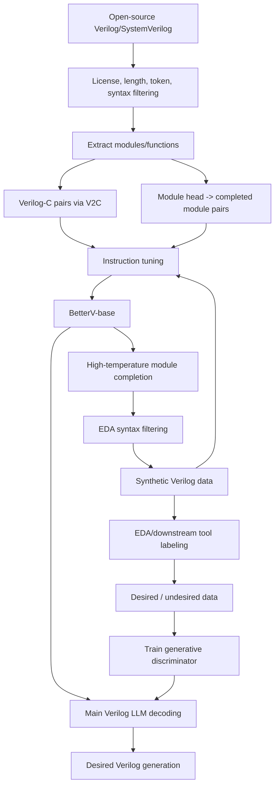

# BetterV Training Method Notes

Paper: BetterV: Controlled Verilog Generation with Discriminative Guidance
Venue/time: ICML 2024 / arXiv:2402.03375
Role in reading: early verifier-guided Verilog generation method, useful for AI-audience framing.

## One-Line Summary

BetterV trains a Verilog-specialized LLM through instruction tuning, augments data with LLM-generated Verilog filtered by EDA tools, then trains a task-specific generative discriminator to guide token-level decoding toward desired Verilog attributes.

```text
BetterV = Verilog instruction tuning
        + synthetic data augmentation
        + EDA-labeled task-specific discriminator
        + discriminator-guided decoding
```

## Overall Pipeline



## 1. Instruction-Tuning Data

BetterV avoids relying on LLM-generated natural-language descriptions. Instead, it builds supervision from Verilog itself.

### Verilog-C Alignment

An existing V2C tool translates Verilog into C:

```text
Verilog module <-> C program
```

This gives two instruction directions:

```text
Instruction: translate Verilog into C.
Input:       Verilog module
Answer:      C program
```

```text
Instruction: translate C into Verilog.
Input:       C program
Answer:      Verilog module
```

Motivation: general code LLMs usually understand C better than Verilog, so C acts as a functional semantic bridge.

### Module Completion

Each Verilog module/function is split into:

```text
module head / definition / port declaration
body
```

The instruction-tuning sample is:

```text
Instruction:
Below is a definition of a Verilog module.
Complete the Verilog program.

Input:
module xxx(...);

Answer:
module xxx(...);
  ...
endmodule
```

This teaches the model to map module names, ports, directions, and signal types to plausible Verilog bodies.

## 2. Autoregressive Training Objective

The main LLM is trained as a standard causal language model. Given an instruction-answer sequence:

```math
p_\theta(x) = \prod_{t=1}^{n} p_\theta(x_t \mid x_{<t})
```

The negative log-likelihood objective is:

```math
\mathcal{L}
= - \frac{1}{|D|} \sum_{i=1}^{|D|}
    \frac{1}{n} \sum_{t=1}^{n}
    \log p_\theta(x_t^i \mid x_{<t}^i)
```

After this stage:

```text
BetterV-base = instruction-tuned Verilog LLM without discriminator guidance
```

## 3. Synthetic Data Augmentation

Because Verilog data is scarce, BetterV uses the fine-tuned LLM to generate more Verilog:

```text
existing module head
-> construct completion instruction
-> high-temperature sampling
-> generated Verilog modules
-> EDA syntax checking
-> filter syntax-error modules
-> synthetic Verilog dataset
```

This mainly improves syntax robustness, style diversity, and module-completion coverage. If the filter only checks syntax, it does not guarantee functional correctness.

## 4. Discriminator Data

The discriminator is trained from binary labels:

```text
c     = desired attribute
c_bar = undesired attribute
```

The meaning of `desired` depends on the downstream task.

Absolute attributes:

```text
syntax correct   vs syntax error
function correct vs function incorrect
```

Relative attributes:

```text
fewer AIG nodes than reference      vs not fewer
shorter SAT solving time than ref   vs not shorter
```

For relative attributes, BetterV keeps a reference Verilog implementation and labels generated samples by comparison with that reference.

## 5. Generative Discriminator

The discriminator is not a plain classifier. It is a class-conditional language model:

```math
p_\theta(x \mid c)
= \prod_{t=1}^{n} p_\theta(x_t \mid x_{<t}, c)
```

It models both:

```text
p_theta(x | desired)
p_theta(x | undesired)
```

Intuition:

```text
If a code sequence has higher likelihood under desired than under undesired,
then it is probably desired.
```

## 6. Discriminator Loss

The discriminator uses a hybrid objective.

Generative loss:

```math
\mathcal{L}_g
= - \frac{1}{|D|} \sum_{i=1}^{|D|}
    \frac{1}{n} \sum_{t=1}^{n}
    \log p_\theta(x_t^i \mid x_{<t}^i, c')
```

where:

```math
c' \in \{c, \bar{c}\}
```

Discriminative loss:

```math
\mathcal{L}_d
= - \frac{1}{|D|} \sum_{i=1}^{|D|}
    \log p_\theta(c_y^i \mid x_{1:n}^i)
```

Total loss:

```math
\mathcal{L}_{total}
= \lambda \mathcal{L}_g + (1 - \lambda) \mathcal{L}_d
```

`lambda` balances language-modeling ability and classification ability.

## 7. Bayes Rule For Attribute Probability

Since the discriminator learns conditional likelihoods:

```text
p_theta(x | c)
p_theta(x | c_bar)
```

BetterV estimates the probability that a partial sequence belongs to a desired class:

```math
p_\theta(c_y \mid x_{1:t})
=
\frac{
  p(c_y) p_\theta(x_{1:t} \mid c_y)^{\alpha/t}
}{
  \sum_{c' \in \{c, \bar{c}\}}
  p(c') p_\theta(x_{1:t} \mid c')^{\alpha/t}
}
```

Interpretation:

```text
Current prefix x_1:t is desired if it is much more likely under the desired
conditional LM than under the undesired conditional LM.
```

## 8. Discriminator-Guided Decoding

The main LLM gives a base next-token distribution:

```math
p_{LLM}(x_t \mid x_{<t})
```

The discriminator reweights it:

```math
p_w(x_t \mid x_{<t}, c)
\propto
p_{LLM}(x_t \mid x_{<t})
\cdot
p_\theta(c \mid x_t, x_{<t})^w
```

Log-score form:

```math
score(x_t)
=
\log p_{LLM}(x_t \mid x_{<t})
+
w \log p_\theta(c \mid x_t, x_{<t})
```

AI-audience interpretation:

```text
Main LLM:        Is this token natural Verilog?
Discriminator:  Does this token move the prefix toward the target attribute?
Guided decode:  Add both scores and sample.
```

`w` controls guidance strength:

```text
w = 0       ordinary LLM decoding
larger w    stronger discriminator guidance
```

BetterV also filters candidate tokens before sampling, keeping high-probability tokens and tokens strongly favored by the discriminator.

## 9. How To Explain 3.5 To AI Researchers

BetterV 3.5 can be described as:

```text
classifier-guided generation for Verilog, implemented with a
class-conditional causal LM and product-of-experts decoding.
```

Slide-friendly formula:

```math
score(v)
=
\log p_G(v \mid s)
+
w \log p_D(y=\text{desired} \mid s + v)
```

where:

```text
s = current prefix
v = candidate next token
G = main Verilog LLM
D = generative discriminator
```

## 10. Relationship To More Recent Methods

From a 2026 perspective, BetterV is an early verifier-guided Verilog generation method. The core idea is still valuable:

```text
EDA tools provide desired / undesired signals,
and HDL generation should optimize executable downstream objectives.
```

However, the specific mechanism is less current than tool-feedback RL methods.

BetterV-style training:

```text
tool labels
-> train small discriminator
-> token-level decoding guidance
```

More recent direction:

```text
SFT / distillation
-> executable verifier or testbench feedback
-> rejection sampling / iterative repair
-> RLVR, GRPO, DAPO, or related RL fine-tuning
```

Modern objective sketch:

```math
\max_\theta
\mathbb{E}_{x \sim \pi_\theta(\cdot \mid prompt)}
\left[
  R_{tool}(x)
\right]
-
\beta
KL(\pi_\theta \| \pi_{ref})
```

where:

```text
R_tool(x) =
  compile reward
  + testbench pass reward
  + formal/equivalence reward
  + synthesis/PPA reward
```

Recent examples:

1. CodeV-R1: RLVR for Verilog generation with testbench/equivalence-oriented data construction.
2. VeriReason: SFT plus GRPO using testbench feedback.
3. VERIRL: Verilog-specific RL framework with reward/rescore mechanisms.
4. RLEF: general code-generation RL from execution feedback.

Positioning:

```text
BetterV is a bridge from SFT-only Verilog generation toward verifier-guided
and RL-with-executable-feedback Verilog generation.
```

## 11. 中文讲解：BetterV 与现代工具反馈训练的区别

可以把两代方法理解成：

```text
BetterV:
先把工具信号压缩成一个小判别器，再用判别器引导生成。

现代方法:
直接把工具、testbench、formal checker 或 synthesis feedback 放进训练或采样循环。
```

### BetterV-Style Training

```text
tool labels
-> train small discriminator
-> token-level decoding guidance
```

第一步，`tool labels` 指的是用 EDA 工具给 Verilog 打标签。

例如生成一段 Verilog 后，用工具判断：

```text
语法是否正确？
testbench 是否通过？
综合后 AIG nodes 是否比 reference 少？
SAT verification runtime 是否比 reference 短？
```

然后把结果转成二分类标签：

```text
desired   = 好的代码
undesired = 不好的代码
```

第二步，训练一个小 discriminator。

这个 discriminator 学的不是自然语言好坏，而是：

```text
什么样的 Verilog 更像 desired？
什么样的 Verilog 更像 undesired？
```

BetterV 里它是一个小的 class-conditional LM：

```text
p_D(x | desired)
p_D(x | undesired)
```

第三步，token-level decoding guidance。

主 LLM 每生成一个 token 时，本来会有：

```text
p_LLM(next_token | prefix)
```

BetterV 再让 discriminator 看：

```text
如果选这个 next_token，prefix + next_token 会更像 desired 吗？
```

然后合并两个分数：

```math
score(v)
=
\log p_{LLM}(v \mid prefix)
+
w \log p_D(desired \mid prefix + v)
```

所以 BetterV 的生成过程像这样：

```text
主模型: 这个 token 像不像正常 Verilog？
判别器: 这个 token 会不会让代码更接近目标？
最终:   两者加权后再采样。
```

优点：

```text
不需要每个任务都重新训练大模型；
只要换一个小 discriminator，就能引导不同目标。
```

缺点：

```text
1. 需要拿到 token logits。
2. 每个 token 都要跑 discriminator，推理慢。
3. discriminator 只是近似工具反馈，不是真正执行工具。
4. 主模型本身没有通过工具反馈被真正强化。
```

### More Recent Direction

```text
SFT / distillation
-> executable verifier or testbench feedback
-> rejection sampling / iterative repair
-> RLVR, GRPO, DAPO, or related RL fine-tuning
```

第一步，`SFT / distillation`。

先让模型具备基本 Verilog 能力：

```text
prompt -> good Verilog solution
```

数据可以来自：

```text
人工答案
已有 benchmark
强模型生成后过滤
工具验证通过的 synthetic data
```

`distillation` 指的是用更强模型生成高质量解法、解释或修复轨迹，再训练小模型模仿。

第二步，`executable verifier or testbench feedback`。

不再只问一个 discriminator 像不像好代码，而是真的运行工具：

```text
iverilog / verilator 编译
testbench 仿真
formal checker
equivalence checking
Yosys 综合
SAT / property checking
```

得到可执行反馈：

```text
compile pass/fail
test pass rate
assertion pass/fail
equivalence pass/fail
area/timing/power estimate
```

第三步，`rejection sampling / iterative repair`。

最简单的现代做法不是马上 RL，而是：

```text
同一个 prompt 生成 N 个候选
-> 用 testbench / verifier 过滤
-> 只保留通过的
```

这叫 rejection sampling。

如果没通过，就进入 repair loop：

```text
生成 Verilog
-> 工具报错
-> 把 error log / failed testcase 喂回模型
-> 让模型修复
-> 再测试
```

这个比 BetterV 更贴近真实编程过程，因为模型看到的是具体失败原因，而不是一个抽象 desired 分数。

第四步，`RLVR / GRPO / DAPO`。

更进一步的方法会把工具结果变成 reward，直接训练模型策略：

```math
\max_\theta
\mathbb{E}_{x \sim \pi_\theta(\cdot \mid prompt)}
\left[
  R_{tool}(x)
\right]
-
\beta
KL(\pi_\theta \| \pi_{ref})
```

其中：

```text
R_tool(x) =
  编译通过奖励
  + testbench 通过奖励
  + formal 验证奖励
  + 综合指标奖励
```

`RLVR` 可以理解成 reinforcement learning with verifiable rewards，也就是 reward 不靠人类偏好模型，而靠可验证工具结果。

`GRPO` / `DAPO` 是具体的 RL 优化算法族。核心思想是用一组生成结果的 reward 来更新模型，让模型更倾向于产生能通过工具验证的代码。

### Core Difference

BetterV 是：

```text
EDA 工具
-> 离线标签
-> 训练 discriminator
-> 解码时引导
```

现代方法是：

```text
EDA 工具 / testbench / verifier
-> 直接作为过滤器、修复反馈或 reward
```

一句话总结：

```text
BetterV 把工具反馈蒸馏成一个小判别器；
现代方法更倾向于直接让模型在编译、测试、验证反馈中学习。
```

对 Verilog 来说，现代方法更自然，因为 HDL 的好坏本来就可以执行验证。语法正确、testbench 通过、formal property 通过、综合指标更好，这些都比“判别器觉得像 desired”更硬。

## References

1. BetterV: Controlled Verilog Generation with Discriminative Guidance, ICML 2024, arXiv:2402.03375.
2. CodeV-R1: https://arxiv.org/abs/2505.24183
3. VeriReason: https://arxiv.org/abs/2505.11849
4. VERIRL: https://arxiv.org/abs/2508.18462
5. RLEF: https://proceedings.mlr.press/v267/gehring25a.html
